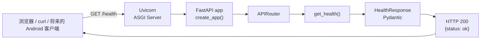
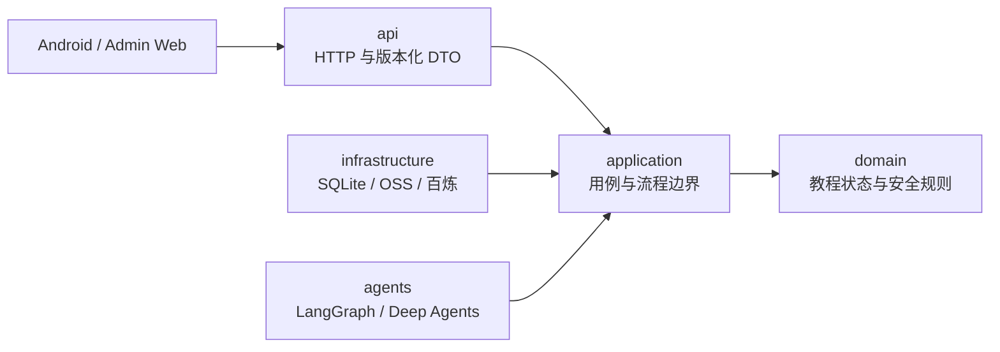

# 模块 00：后端基础骨架

> 完成日期：2026-07-23
>
> 模块状态：代码、测试、格式检查、静态类型检查和依赖锁检查均已通过
>
> 本模块边界：只建立“能启动、能配置、能检查存活、能自动验证”的 API 外壳

## 1. 这一模块解决了什么问题

“老牌子”以后会连接 Android 客户端、教程数据、语音服务、视觉模型和 Deep Agents。越是有很多外部组件，越需要先建立一个稳定的运行边界：

1. 开发者能用一条命令得到一致的 Python 环境。
2. 服务启动时就能发现非法配置，而不是运行到某个请求才失败。
3. 运维或客户端能判断 API 进程是否存活。
4. 每次修改都能自动验证 API 契约、格式和类型。

本模块刻意没有接入 SQLite、百炼、OSS、认证和 Agent。现在创建这些空壳只会让我们在还没有真实用例时猜抽象，增加学习噪音。

## 2. 当前目录结构

```text
.
├── .python-version
├── pyproject.toml
├── uv.lock
├── src/
│   ├── .gitignore
│   └── guojing/
│       ├── __init__.py
│       ├── main.py
│       ├── api/
│       │   ├── __init__.py
│       │   ├── health.py
│       │   └── router.py
│       └── core/
│           ├── __init__.py
│           └── config.py
└── tests/
    ├── .gitignore
    ├── conftest.py
    ├── test_main.py
    ├── api/
    │   └── test_health.py
    └── core/
        └── test_config.py
```

这里采用 Python 的 `src layout`：包不直接放在仓库根目录，而是放在 `src/guojing/`。它能避免测试时误把“当前目录中的源码”当成已安装包，从而更接近真实部署行为。

由于仓库根 `.gitignore` 保持用户删除状态，`src/.gitignore` 和 `tests/.gitignore` 只在各自目录内排除 `__pycache__` 与 `.pyc` 字节码，避免把本机生成物提交进 Git。

## 3. 一次请求经历了什么



调用链可以拆成三层：

- **Uvicorn** 是网络服务器，监听端口并把 HTTP 转成 ASGI 消息。它类似 Spring Boot 中内嵌的 Tomcat/Netty，但遵循的是 Python 的 ASGI 协议。
- **FastAPI** 负责路由、依赖注入、输入输出校验和 OpenAPI 文档。
- **Pydantic** 把 Python 类型变成运行时校验规则和 JSON Schema，FastAPI 再据此序列化响应。

`get_health()` 使用 `async def`。它目前没有 I/O，只会立即返回；以后在异步路由里不能直接执行阻塞数据库驱动或长时间 CPU 工作，否则会像在 Netty event loop 上执行阻塞代码一样拖住其他请求。

## 4. 为什么使用应用工厂

入口在 `src/guojing/main.py`：

```python
def create_app(settings: Settings | None = None) -> FastAPI:
    app_settings = settings or Settings()
    application = FastAPI(
        title=app_settings.app_name,
        debug=app_settings.debug,
    )
    application.state.settings = app_settings
    application.include_router(api_router)
    return application


app = create_app()
```

模块级的 `app` 是 Uvicorn 的入口；`create_app()` 则让测试可以创建彼此隔离的应用实例，并注入测试配置。

和 Java/Spring 的对应关系不是一一相等，但可以这样理解：

| Python/FastAPI | Java/Spring 中相近的概念 | 关键差异 |
|---|---|---|
| `uvicorn guojing.main:app` | `SpringApplication.run(...)` | Uvicorn 先加载一个 ASGI 对象 |
| `create_app()` | 构建 `ApplicationContext` | FastAPI 本身更轻，不会扫描并实例化整套 Bean |
| `APIRouter` | `@RestController` + 路由映射 | 路由通过显式 `include_router` 组合 |
| Pydantic `BaseModel` | Java record + Jackson + Bean Validation | Python 类型提示会在运行时由 Pydantic校验 |
| `TestClient` | MockMvc / WebTestClient | 测试直接穿过 ASGI 边界，不占真实端口 |

应用工厂不是为了引入一个复杂的 DI 框架。当前只有一个明确依赖 `Settings`，直接传参最清楚。

## 5. 配置系统

配置在 `src/guojing/core/config.py` 中集中声明：

```python
class Settings(BaseSettings):
    model_config = SettingsConfigDict(
        env_prefix="GUOJING_",
        case_sensitive=False,
        extra="ignore",
        frozen=True,
        str_strip_whitespace=True,
    )

    app_name: str = Field(default="老牌子 API", min_length=1)
    environment: AppEnvironment = AppEnvironment.LOCAL
    debug: bool = False
```

它相当于一个不可变的、带校验的 `@ConfigurationProperties`：

- 只接受 `local`、`test`、`staging`、`production` 四种环境名。
- 所有环境变量都使用 `GUOJING_` 前缀，避免与系统或其他项目变量冲突。
- `frozen=True` 防止运行过程中悄悄修改配置。
- 非法值会让应用在启动阶段失败，也就是 fail fast。

当前可用变量：

| 环境变量 | 默认值 | 作用 |
|---|---|---|
| `GUOJING_APP_NAME` | `老牌子 API` | OpenAPI 标题 |
| `GUOJING_ENVIRONMENT` | `local` | 运行环境 |
| `GUOJING_DEBUG` | `false` | FastAPI 调试模式 |

Fish shell 临时启动示例：

```fish
env GUOJING_ENVIRONMENT=local GUOJING_DEBUG=true \
  uv run uvicorn guojing.main:app --reload
```

这里暂时只读取进程环境变量，没有自动读取 `.env`。原因是根 `.gitignore` 目前处于用户主动删除的状态；在重新确认忽略规则前，不引导创建可能被误提交的密钥文件。

## 6. `/health` 为什么这么简单

接口契约：

```http
GET /health

HTTP/1.1 200 OK
Content-Type: application/json

{"status":"ok"}
```

它只回答一个问题：**当前 API 进程是否还能响应请求？**

它不会检查 SQLite、OSS、百炼或网络。外部模型短暂不可用，不应该让部署平台认为进程已经死亡并反复重启。

将来接入真正的必要依赖后，可以另加 `/ready`：

- `/health`（liveness）：进程是否活着。
- `/ready`（readiness）：当前实例是否适合接收业务流量。

`/health` 也没有放进 `/api/v1`。它是运维接口，不是 Android 客户端的版本化业务协议。

## 7. 依赖管理：`pyproject.toml` 与 `uv.lock`

### 7.1 两个文件分工

`pyproject.toml` 描述“允许使用什么范围”：

```toml
"fastapi>=0.139.2,<0.140.0"
```

`uv.lock` 记录“这次验证的精确依赖图”，包括直接依赖、传递依赖、版本、平台条件和文件哈希。

可以把它类比为：

- `pyproject.toml`：`build.gradle.kts` / `pom.xml` 中的依赖声明和插件配置。
- `uv.lock`：Gradle dependency locking 或 Maven 中额外维护的锁定结果，但 uv 把它作为项目工作流的一等公民。
- `.venv`：项目独立的运行时 classpath；它是生成物，不提交。

`uv sync` 默认把环境精确同步到锁文件。不要在项目环境中直接执行 `pip install`，因为那会制造“本机能跑、声明里没有”的隐藏依赖。

### 7.2 当前锁定的主要版本

| 依赖 | 锁定版本 | 作用 |
|---|---:|---|
| Python | 3.12.13 | 项目解释器 |
| FastAPI | 0.139.2 | Web/API 框架 |
| Uvicorn | 0.51.0 | ASGI 服务器 |
| Pydantic | 2.13.4 | API 数据校验与序列化 |
| pydantic-settings | 2.14.2 | 类型化配置 |
| HTTPX2 | 2.7.0 | Starlette/FastAPI 测试客户端底层 |
| pytest | 9.1.1 | 测试框架 |
| Ruff | 0.15.22 | Lint、导入排序和格式检查 |
| mypy | 2.3.0 | 静态类型检查 |

FastAPI 仍是 `0.x`，官方说明 minor 版本可能包含破坏性变更，因此约束在 `<0.140.0`，再由测试确认何时升级。

第一次测试曾解析到旧 `httpx` 并出现 Starlette 弃用警告。检查实际上游实现后改为 Pydantic 团队维护的 `httpx2`，测试 API 不变，警告消失。这展示了“锁定 + 实际运行 + 处理警告”的完整依赖升级流程。

Python 3.12 当前处于只接收安全修复的阶段，预计支持到 2028 年 10 月。本 MVP 使用你已经安装的 3.12.13 很稳妥；进入长期维护或部署前应设置一次 Python 3.13/3.14 升级检查点。

## 8. 测试分别保护什么

当前共 5 个测试：

1. `/health` 返回固定状态码、Content-Type 和 JSON 契约。
2. 配置具有安全的本地默认值。
3. `GUOJING_` 环境变量能覆盖默认值。
4. 未知环境名会立即触发 `ValidationError`。
5. `create_app()` 确实使用注入的测试配置。

测试使用 FastAPI/Starlette 的 `TestClient`。它不会启动真实 TCP 端口，但请求仍会经过 ASGI 应用、路由、Pydantic 和响应序列化，所以比直接调用 `get_health()` 更能保护 HTTP 契约。

这一层测试故意不联网、不连接数据库、不初始化模型。它应该快速、确定，并且在离线 CI 中也能运行。

## 9. 本地开发命令

在仓库根目录执行。

### 9.1 安装并同步环境

```bash
uv sync
```

`uv` 会读取 `.python-version`，创建 `.venv`，并安装 `uv.lock` 中的版本。`.venv` 自带内部忽略规则，不会出现在 Git 变更中。

### 9.2 启动服务

```bash
uv run uvicorn guojing.main:app --reload
```

可访问：

- 健康检查：<http://127.0.0.1:8000/health>
- Swagger UI：<http://127.0.0.1:8000/docs>
- ReDoc：<http://127.0.0.1:8000/redoc>

终端验证：

```bash
curl http://127.0.0.1:8000/health
```

预期：

```json
{"status":"ok"}
```

### 9.3 执行测试

```bash
uv run pytest
```

当前预期：`5 passed`。

### 9.4 执行质量检查

```bash
uv run ruff check .
uv run ruff format --check .
uv run mypy
uv lock --check
git diff --check
```

需要自动格式化时使用：

```bash
uv run ruff format .
```

Ruff 同时承担了 Python 项目中常见的 Flake8、isort 和 Black 的大部分职责，减少工具间配置冲突。mypy 使用 strict 模式；现在代码量很小时建立严格基线，比项目变大后补类型容易得多。

## 10. 常见问题与排查

### `uv` 使用了错误的 Python

先执行：

```bash
uv run python --version
```

当前应显示 `Python 3.12.13`。`.python-version` 负责告诉 uv 项目默认解释器，`requires-python` 则是包级兼容约束。

### 端口 8000 已被占用

```bash
uv run uvicorn guojing.main:app --reload --port 8001
```

### 修改环境变量后没有生效

全局 `app` 在模块导入时创建，配置也在此时读取。开发服务器通常会在文件变化后重新加载；如果只修改 shell 环境变量，需要停止并重新启动进程。

### 为什么不使用 Conda 环境

Conda 可以继续用于数据科学或需要系统级二进制依赖的项目。这个后端的 Python 依赖全部由 uv 管理，单项目只保留一套环境管理方式，可以避免激活 Conda 环境后又把包装进 `.venv` 的混合状态。

## 11. 为后续模块保留的架构边界

现在不创建空目录，但后续代码按真实用例逐步长成：



关键约束：

- Android 只依赖版本化 API DTO，不接触 ORM 模型或 LangGraph state。
- Agent 通过受限、结构化工具调用 application 层，不直接拿数据库 Session 或任意网络能力。
- 金融、隐私和不可逆操作的安全判定放在确定性代码中，不能只靠模型提示词。
- 时间统一使用 UTC/RFC 3339，标识符对客户端表现为不透明字符串。

## 12. 为什么本模块没有做这些事

- **SQLite/SQLAlchemy/Alembic**：还没有第一个需要持久化的数据用例。
- **Deep Agents/LangGraph**：还没有明确的 Agent 输入输出契约和安全工具边界。
- **认证**：需要和设备配对、管理网页登录一起设计，不能先放一个临时宽松方案。
- **CORS**：管理网页来源尚未确定；现在开放 `*` 会留下不安全默认值。
- **Docker**：本地直接运行已经能验证代码；等数据库与部署边界明确后再容器化更有学习价值。
- **Redis/Celery/消息队列**：MVP 没有证明需要分布式任务系统。

## 13. 你可以亲手做的练习

练习按推荐顺序排列：

1. 把 `GUOJING_ENVIRONMENT=qa` 启动服务，观察 Pydantic 的错误结构，再恢复为 `local`。
2. 给 `Settings.app_name` 传入全空格值，写一个测试验证它被拒绝。
3. 给 `/health` 响应增加固定的 `service: "guojing-api"` 字段，先改测试再改实现，体验契约驱动。
4. 只做设计题：写出未来 `/ready` 在“数据库可用”和“数据库不可用”时的响应，不要现在实现。

自检问题：

- 为什么 `uv.lock` 不能只由 `pyproject.toml` 替代？
- 为什么健康检查不调用百炼模型？
- `create_app()` 相比直接只声明一个全局 `app`，给测试带来了什么？
- `async def` 路由中直接调用阻塞 SDK 会发生什么？

## 14. 下一模块建议

下一模块建议建立“第一个垂直业务切片”，而不是先搭一整套通用基础设施。较合适的候选是：

1. **设备注册与配对领域模型**：为 Android 与家属网页建立安全身份边界。
2. **教程目录只读 API**：先定义 Android 获取常用任务列表的版本化契约。
3. **教程状态图领域模型**：先实现纯 Python 状态匹配与迁移规则，不接模型。

进入下一模块前，先确认本模块的目录、命令和设计取舍是否符合你的预期。

## 15. 官方参考资料

- [FastAPI 版本策略](https://fastapi.tiangolo.com/deployment/versions/)
- [FastAPI 测试](https://fastapi.tiangolo.com/tutorial/testing/)
- [uv 项目结构](https://docs.astral.sh/uv/concepts/projects/layout/)
- [uv 锁定与同步](https://docs.astral.sh/uv/concepts/projects/sync/)
- [Pydantic Settings](https://pydantic.dev/docs/validation/latest/concepts/pydantic_settings/)
- [HTTPX2 项目页](https://pypi.org/project/httpx2/)
- [Ruff 版本策略](https://docs.astral.sh/ruff/versioning/)
- [Python 版本状态](https://devguide.python.org/versions/)
