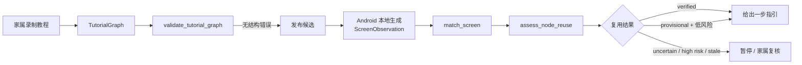
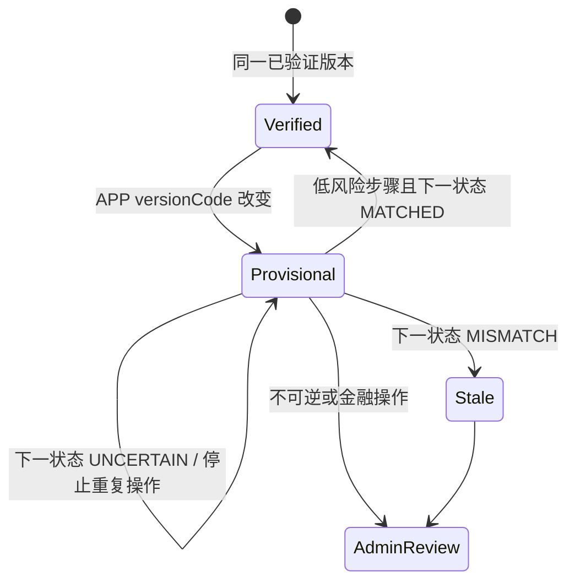

# 模块 01：教程状态图核心领域模型

> 完成日期：2026-07-28
>
> 模块状态：领域模型、图校验、页面匹配、版本复用评估和测试均已完成
>
> 本模块边界：纯 Python 业务规则，不接 HTTP、数据库、Android UI 树或 AI 模型

## 1. 这一模块回答的产品问题

你之前提出了一个决定产品能否长期使用的问题：

> APP 更新很快。如果界面只变了一部分，旧教程还能使用吗？

如果教程只是保存“点击屏幕坐标 `(430, 1260)`”，答案通常是否定的。分辨率、字体大小、系统缩放、广告位和一次小改版，都可能让这个坐标指向完全不同的控件。

本模块把教程建模为**状态图**：

- 节点：一个可识别的页面状态。
- 锚点：页面上有业务意义的 UI 元素。
- 边：用户执行的一步操作，以及操作后应到达的页面。
- 验证状态：这个节点在当前 APP 版本上是已验证、待验证还是已过期。

APP 版本号只是风险信号，不是唯一判断条件。真正决定能否继续使用的是：

1. 当前 Android 包名是否正确。
2. 必需锚点是否仍存在。
3. 禁止锚点是否出现。
4. 页面结构是否仍相似。
5. 执行一步后是否到达预期的下一状态。
6. 这一步是否属于高风险操作。

## 2. 新增目录

```text
src/guojing/domain/
├── __init__.py
└── tutorials/
    ├── __init__.py
    ├── models.py
    ├── validation.py
    ├── matching.py
    └── compatibility.py

tests/domain/
├── __init__.py
└── tutorials/
    ├── __init__.py
    ├── conftest.py
    ├── test_models.py
    ├── test_validation.py
    ├── test_matching.py
    └── test_compatibility.py
```

这四个生产模块各自只有一个职责：

| 模块 | 负责 | 不负责 |
|---|---|---|
| `models.py` | 表达 APP、锚点、节点、边和图 | 判断整个图是否连通 |
| `validation.py` | 检查跨节点、跨边的结构约束 | 识别手机当前页面 |
| `matching.py` | 将本地识别证据与一个节点比较 | 判断新版教程是否允许复用 |
| `compatibility.py` | 根据版本、风险和下一状态决定复用级别 | strict/assisted 安全授权 |

拆开后，我们可以独立测试每层，也不会把“模型识别不确定”“图本身损坏”“安全策略禁止”混成同一个失败。

## 3. 从录制到运行的调用链



现在实现了图中间的三个纯函数阶段。录制网页、Android UI 树提取、发布 API 和持久化会在后续模块接入。

## 4. 为什么状态图比线性步骤更合适

线性教程通常长这样：

```text
步骤 1 -> 步骤 2 -> 步骤 3 -> 步骤 4
```

真实 APP 经常存在分支：

- 用户已经登录或尚未登录。
- 微信红包已领取、已过期或仍可领取。
- 定位权限已授权或未授权。
- 页面出现升级弹窗或广告。
- 导航已经在当前位置，或需要先选择城市。

状态图允许一个节点有多条边，并允许必要的回退和循环。当前校验器允许环，但要求至少存在一个终点，避免教程变成永远无法完成的闭环。

图中的 `target_node_id` 同时表达“下一步去哪”和“执行后如何验证成功”。这比保存一个 `step_number + 1` 更适合处理分支。

## 5. 领域模型详解

### 5.1 `AppIdentity`

```python
@dataclass(frozen=True, slots=True)
class AppIdentity:
    package_name: str
    version_name: str
    version_code: int
```

- `package_name`：Android 稳定应用标识，例如微信的 `com.tencent.mm`。
- `version_name`：给人看的版本名，例如 `8.0.60`。
- `version_code`：Android 用于比较发布版本的递增整数。

代码只用 `version_code` 判断是否与已验证版本相同，因为 `version_name` 可能包含厂商自定义格式，不应该自行按语义化版本解析。

### 5.2 `SemanticLocator`

一个锚点可以保存多种语义定位信息：

- `resource_id`：Android View 的资源 ID，通常最稳定。
- `content_description`：无障碍描述。
- `text`：UI 树中的控件文字。
- `ocr_text`：只有图像文字可用时的识别结果。

这些信息优先于坐标。坐标只保存在 `NormalizedBounds` 中作为最后兜底，并转换为 `0..1` 的屏幕比例：

```text
left = 像素左边界 / 屏幕宽度
top = 像素上边界 / 屏幕高度
```

即使分辨率变化，比例位置仍比绝对像素可靠。但它仍会受布局改版影响，所以不能成为首选定位方式。

### 5.3 三种锚点角色

```python
class AnchorRole(StrEnum):
    REQUIRED = "required"
    OPTIONAL = "optional"
    FORBIDDEN = "forbidden"
```

它们的业务含义不同：

| 类型 | 例子 | 缺失或出现后的处理 |
|---|---|---|
| 必需锚点 | 微信“聊天”标签、目标联系人 | 缺失时结果为不确定，停止自动推进 |
| 可选锚点 | 搜索按钮、非关键标题 | 缺失不会单独判定失败 |
| 禁止锚点 | 支付密码、授权确认、危险弹窗 | 一旦出现立即判定页面不匹配 |

“禁止锚点”不是负权重，而是硬门禁。例如教程本来要打开聊天，但当前屏幕出现“支付密码”，系统不应该因为其他控件相似而继续画箭头。

### 5.4 相对结构

`RelativeConstraint` 表达：

- 在另一个锚点上方或下方。
- 位于另一个区域内部。
- 在左侧、右侧或附近。

当前 Android 还没有接入，所以本模块只保存结构关系，并接收一个已经计算好的 `structure_score`。以后 Android 本地匹配器负责把 UI 树关系转换成这个分数。

### 5.5 页面隐私

```python
class PrivacyMode(StrEnum):
    NETWORK_ALLOWED = "network_allowed"
    LOCAL_ONLY = "local_only"
    CAPTURE_PAUSED = "capture_paused"
```

- `NETWORK_ALLOWED`：普通、非敏感页面可以把经过规则允许的数据交给后端。
- `LOCAL_ONLY`：页面匹配只能在手机本地完成。
- `CAPTURE_PAUSED`：用户名、密码、验证码、生物识别等阶段完全停止采集。

测试样例中的微信聊天列表和聊天页使用 `LOCAL_ONLY`。后端测试只接收锚点 ID 与置信度，不接收联系人名字、聊天内容或截图。

### 5.6 操作风险

```python
class RiskLevel(StrEnum):
    LOW = "low"
    SENSITIVE = "sensitive"
    IRREVERSIBLE = "irreversible"
    FINANCIAL = "financial"
```

隐私与风险是两条独立轴：

- 浏览图库：隐私高，但操作本身通常可逆。
- 点击“确认支付”：即使页面没有私人图片，操作风险仍非常高。
- 输入登录密码：既需要暂停采集，也属于敏感流程。

如果只用一个 `is_sensitive` 布尔值，会无法准确表达这些组合。

## 6. 为什么使用不可变 dataclass

领域对象使用：

```python
@dataclass(frozen=True, slots=True)
```

可以类比 Java record：

- `frozen=True`：构造后不能直接修改字段，状态变化要创建新值。
- `slots=True`：字段集合固定，减少内存，也避免拼错属性名后动态创建新字段。
- 自动生成构造器、比较和可读的 `repr`。

教程验证状态以后发生变化时，我们会显式创建新节点并通过 Repository 保存，而不是在某个 Agent 工具中悄悄修改共享对象。

领域层没有使用 Pydantic。Pydantic 很适合 HTTP DTO 和外部数据校验，但核心业务规则保持为标准库对象，可以避免领域层依赖 FastAPI/Pydantic 的生命周期和序列化行为。后续 API DTO 会显式映射到这些领域对象。

## 7. 两层校验：局部不变量与图不变量

### 7.1 构造时立即拒绝局部非法值

以下问题在对象构造时直接抛出 `ValueError`：

- 空包名、空节点 ID、空指令。
- `version_code <= 0`。
- 越出屏幕范围或反向的矩形。
- 没有任何有效字段的语义定位器。
- 小于 0、大于 1、`NaN` 或无穷大的置信度。

这些错误只涉及对象自身，没有继续收集的价值。

### 7.2 一次返回全部跨对象问题

`validate_tutorial_graph()` 会收集整个草稿的所有结构错误：

- 重复节点或边 ID。
- 起点不存在。
- 节点没有必需锚点。
- 相对关系引用不存在的锚点或引用自己。
- 已验证节点没有已验证版本。
- 边引用不存在的源节点或目标节点。
- 点击、长按、输入动作缺少目标锚点。
- 等待、系统返回动作错误地指定目标锚点。
- 操作指向禁止锚点。
- 节点从起点不可达。
- 图没有任何终点。

录制管理员可以一次修复所有问题，而不是每次保存只看到第一个错误。

当进入一个必须保证图有效的应用用例时，调用：

```python
require_valid_tutorial_graph(graph)
```

它会抛出包含全部 `GraphValidationIssue` 的 `InvalidTutorialGraph`。

这类似 Bean Validation 收集约束错误与领域服务检查聚合一致性的组合，但这里的错误代码是稳定枚举，未来管理网页可据此定位到具体节点或边。

## 8. 页面匹配算法

入口：

```python
match_screen(graph, node, observation)
```

### 8.1 硬规则

以下条件不参与加权，直接决定结果：

1. Android 包名不同：`MISMATCH`。
2. 禁止锚点置信度达到阈值：`MISMATCH`。
3. 必需锚点缺失：`UNCERTAIN`，而不是永久判定教程失效。

为什么必需锚点缺失只是“不确定”？

因为 Android 无障碍树也可能暂时不完整，动画、异步加载或厂商系统差异都可能导致一次观测缺少控件。一次失败不能自动污染已发布教程的持久状态。

### 8.2 初始评分

当前默认策略：

```text
页面分数 =
    必需锚点平均置信度 × 0.75
  + 可选锚点平均置信度 × 0.10
  + 结构相似度           × 0.15
```

- 锚点存在阈值：`0.80`
- 页面匹配阈值：`0.90`

可选锚点全部消失时，只损失 `0.10`；如果必需锚点和结构完全匹配，总分仍为 `0.90`，教程可以继续使用。

这些数字是 MVP 的明确初始策略，不是经过大规模数据证明的最终参数。以后要用真实录制页面建立评估集，分别统计误导用户的 false positive 和不必要求助的 false negative，再调整阈值。

### 8.3 版本号为什么不进入匹配分数

测试明确验证：

> 同一包名的新版本，只要页面锚点和结构仍然一致，页面匹配结果仍可为 `MATCHED`。

如果版本一变化就把分数归零，那么每次微信小版本升级都要重录全部教程，状态图便失去意义。版本兼容性由下一阶段单独判断。

## 9. APP 更新后的复用状态机

`assess_node_reuse()` 接收：

- 节点之前的验证状态。
- 当前 APP 的 `version_code`。
- 当前页面匹配结果。
- 将要执行的边及其风险。
- 如果已经执行，预期下一页面的匹配结果。



决策表：

| 情况 | 结果 | 是否可试走这条边 | 是否需要管理员 |
|---|---|---:|---:|
| 节点已被标记 stale | stale | 否 | 是 |
| 当前页面 mismatch | stale（仅本次观测） | 否 | 否 |
| 当前页面 uncertain | provisional | 否 | 否 |
| 同一已验证版本 | verified | 是 | 否 |
| 新版本、低风险、尚未执行 | provisional | 是一次 | 否 |
| 新版本、低风险、下一状态 matched | verified | 是 | 否 |
| 下一状态 uncertain | provisional | 否，防止重复操作 | 高风险时需要 |
| 下一状态 mismatch | stale | 否 | 是 |
| 新版本、不可逆/金融操作 | provisional | 否 | 是 |
| 新版本的终点节点 | provisional | 无边可自证 | 否 |

### 非常重要：评估函数不会自己修改数据库

`ReuseAssessment.status == STALE` 不意味着应该立刻永久更新教程。

例如用户可能只是切到了错误页面。应用层以后会结合连续失败次数、其他节点匹配结果和管理员策略，决定是否持久化状态。纯函数只描述“这一次观测应如何处理”。

### 兼容性也不等于安全授权

`can_attempt_transition=True` 只说明**为了兼容性验证可以尝试这条边**。

它不代表 strict 模式允许付款或发送好友请求。strict/assisted 的最终安全授权属于独立模块；即使教程节点已经 verified，高风险动作仍要按用户安全模式停止或确认。

## 10. 页面信息如何保护隐私

`ScreenObservation` 当前只有：

```text
AppIdentity
anchor_id + confidence
structure_score
```

它不包含：

- 原始截图。
- UI 树完整文本。
- 联系人姓名。
- 聊天内容。
- 余额、红包金额或支付密码。

未来 Android 会根据 `PrivacyMode` 决定这份证据能否上传。`LOCAL_ONLY` 页面应直接在手机内执行同样的匹配与兼容规则，后端最多接收脱敏后的状态结果。

本模块先实现纯 Python 参考规则，后续 Android/Kotlin 版本必须用同一组测试向量验证行为一致，避免两端算法漂移。

## 11. 测试策略

本模块新增 29 个测试，项目总计 34 个测试。

覆盖范围：

- 坐标、版本、定位器和置信度边界。
- 正常图、重复节点、不可达节点、缺失目标、禁止目标和无终点环。
- 强匹配、缺失必需锚点、禁止锚点、错误包名、新版本和可选锚点消失。
- 同版本复用、新版本低风险试走、下一状态验证、高风险人工复核。
- 下一状态不确定时停止重复动作。
- 已持久化 stale 节点不能自动复活。

所有测试：

- 不联网。
- 不加载模型。
- 不连接数据库。
- 不读取真实联系人或截图。

运行：

```bash
uv run pytest tests/domain/tutorials
```

全项目检查：

```bash
uv run pytest
uv run ruff check .
uv run ruff format --check .
uv run mypy
uv lock --check
git diff --check
```

## 12. 与 Java 领域建模的对应

| Python 实现 | Java 中相近的做法 |
|---|---|
| frozen dataclass | record / 不可变 Value Object |
| `StrEnum` | 带字符串编码的 enum |
| `tuple` | 不可变 List 的意图 |
| `__post_init__` | compact constructor 中的局部校验 |
| `validate_tutorial_graph()` | 聚合校验 Domain Service |
| `GraphValidationIssue` | 带错误码的 ValidationError DTO |
| `match_screen()` | 无副作用的领域策略 |
| `ReuseAssessment` | sealed decision/result 类型的简化形式 |
| pytest fixture | JUnit fixture / Object Mother |
| `dataclasses.replace()` | 基于 record 创建修改副本 |

Python 的类型提示不会像 Java 编译器一样在运行时强制执行，所以这里同时依赖：

1. mypy 的 strict 静态检查。
2. 构造函数的运行时值校验。
3. 跨对象的图结构校验。
4. 行为测试。

## 13. 本模块刻意没有实现的内容

- **JSON/Pydantic DTO**：等真正设计管理 API 和 Android API 时再建立显式映射。
- **SQLite Repository**：尚未实现保存草稿、发布和读取教程的用例。
- **Android UI 树匹配**：当前只定义后端参考算法和输入证据。
- **OCR/视觉模型调用**：它们以后负责生成锚点证据，不负责最终安全决策。
- **坐标点击**：老牌子只指引用户点击，不自动操作其他 APP。
- **安全模式授权**：compatibility 不是 strict/assisted policy。
- **连续两次失败后求助**：这是帮助会话状态机的职责。
- **自动发布**：即使低风险试走成功，也只能形成待审核状态，不能直接发布教程。

## 14. 你可以亲手完成的练习

### 练习 1：构造抖音搜索状态图

建立三个节点：

```text
首页 -> 搜索页 -> 搜索结果页
```

为每个节点分别设计 required、optional、forbidden 锚点，并说明哪些文本容易随版本变化。

### 练习 2：观察可选锚点的权重

复制 `test_optional_anchor_can_disappear_without_invalidating_screen`，逐步降低必需锚点或结构分数，观察何时从 `MATCHED` 变成 `UNCERTAIN`。

### 练习 3：把低风险操作改成金融操作

把测试中的 `open_family_chat` 风险改为 `FINANCIAL`，即使下一状态成功匹配，也应该要求管理员复核。思考为什么“结果符合预期”仍不能自动证明金融流程安全。

### 练习 4：设计红包三个分支

为微信原生红包设计：

- 可领取。
- 已被领取。
- 已过期。

思考它们应是三个节点、三条边，还是同一节点的三个匹配结果。

自检问题：

- 为什么 APP 版本变化不直接让页面 `MISMATCH`？
- required 锚点缺失为什么是 `UNCERTAIN` 而不是永久 `STALE`？
- privacy mode 和 risk level 分别控制什么？
- 为什么下一状态不确定时不能重复尝试当前动作？
- 为什么 `assess_node_reuse()` 不直接更新节点状态？

## 15. 下一模块建议

下一模块建议实现“教程草稿发布与读取”垂直切片：

1. 定义管理端提交教程图的 Pydantic DTO。
2. DTO 显式映射为本模块的领域对象。
3. 调用图校验并返回结构化错误。
4. 使用 SQLite 保存草稿和已发布版本。
5. 提供管理端发布 API 与 Android 只读教程 API。

到那时再引入数据库和迁移工具，因为我们已经有第一个明确的持久化用例，而不是为了架构完整提前创建空 Repository。
