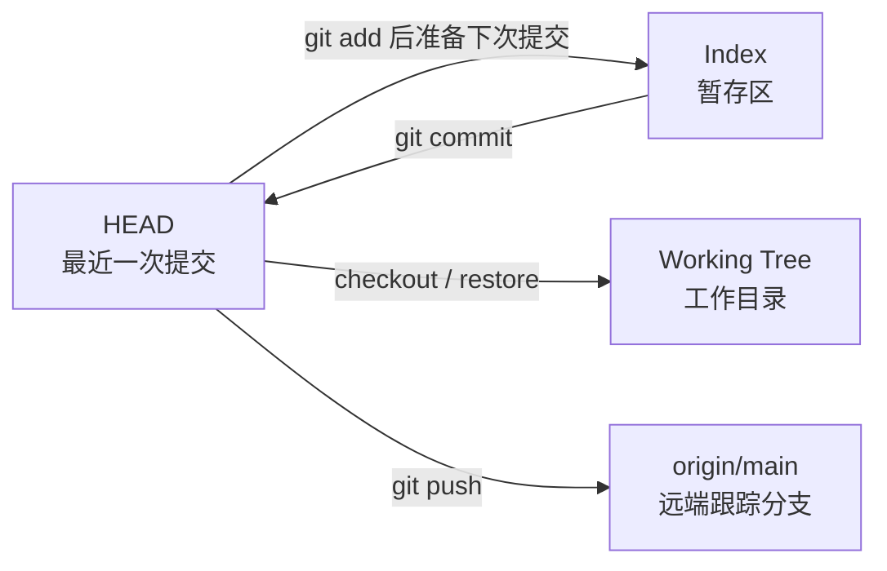

# 模块 02：Git 仓库治理

> 完成日期：2026-07-28
>
> 模块状态：项目级忽略规则、README、LICENSE 和仓库指南已整理
>
> 本模块边界：只处理仓库元数据和开发者入口，不修改产品业务逻辑

## 1. 为什么总能看到三个删除

之前 `git status --short` 持续显示：

```text
 D .gitignore
 D LICENSE
 D README.md
```

Git 同时维护三个容易混淆的状态：



当时的真实状态是：

| 位置 | 三个文件 |
|---|---|
| GitHub `origin/main` | 存在 |
| 本地 `HEAD` | 存在 |
| 暂存区 | 没有记录删除 |
| 本地工作目录 | 文件不存在 |

`git status --short` 有两列状态。` D` 的第一个位置为空、第二个位置为 `D`：

- 第一列：暂存区相对 `HEAD` 的变化。
- 第二列：工作目录相对暂存区的变化。

所以 ` D` 表示“文件在工作目录中被删除，但删除尚未暂存”。

之前每次提交都反复说明，是为了证明没有把这三个无关删除混入模块提交。尤其不能在这种混合工作区中使用：

```bash
git add -A
```

否则所有未暂存删除都会一起进入下一次提交。

## 2. 这次如何处理

### `.gitignore`

旧文件是 200 多行的通用 Python 模板。它覆盖很多本项目不会使用的框架，却没有 Android、Gradle、Node.js 和 pnpm。

现在改成项目级规则，覆盖：

- `.env`、密钥和 `local.properties`。
- macOS、IntelliJ/Android Studio、VS Code。
- Python、uv、pytest、mypy、Ruff。
- 本地 SQLite、日志、上传和数据目录。
- Android、Gradle、APK/AAB。
- Node.js、pnpm 和前端覆盖率。

原来的 `src/.gitignore` 和 `tests/.gitignore` 已删除。根规则能够递归匹配 `__pycache__/` 和 `.pyc`，没有必要维护重复规则。

### `README.md`

旧 README 只有项目名和一句英文描述，不能回答：

- 产品解决什么问题。
- 当前做到了哪里。
- 如何启动和测试。
- 安全与隐私边界是什么。
- 学习文档在哪里。
- 下一步准备开发什么。

新的 README 是进入仓库后的第一份真实接口文档。它只描述已经实现的能力，并把未实现部分明确标记为计划，避免把愿景写成可运行事实。

### `LICENSE`

仓库最初使用完整的 GNU General Public License v3.0。

许可证不是普通说明文件。把 GPL 改成 MIT、Apache-2.0，或者删除许可证，都会改变他人复制、修改和分发代码的权利。本次没有足够理由改变法律选择，因此从 Git 历史原样恢复 GPL-3.0。

未来如果需要更换许可证，应单独讨论：

- 项目是否继续公开。
- 是否允许闭源衍生。
- 是否包含第三方贡献。
- 所有版权持有人是否同意变更。

## 3. `.gitignore` 到底做什么

`.gitignore` 只影响**尚未被 Git 跟踪的文件**。

假设 `secret.env` 已经提交过，再把它写入 `.gitignore` 并不会从历史或暂存区中删除。必须另行移除跟踪并处理泄露的密钥。

因此：

> `.gitignore` 是减少误操作的安全网，不是秘密管理系统。

提交前仍要检查：

```bash
git status --short
git diff --cached
```

## 4. 规则如何匹配

常见写法：

```gitignore
# 任意层级的 Python 字节码目录
__pycache__/

# 任意层级的 .pyc、.pyo、.pyd
*.py[cod]

# 根或子目录中的 build
**/build/

# 忽略所有环境文件
.env.*

# 但允许提交示例
!.env.example
```

后面的规则可以用 `!` 对前面的忽略进行反选。顺序因此有意义。

排查某个文件为什么被忽略：

```bash
git check-ignore -v path/to/file
```

输出会指出具体是哪一个 `.gitignore`、哪一行规则命中。

## 5. 哪些生成物要忽略，哪些锁文件要提交

### 应忽略

- `.venv/`、`node_modules/`：可以由依赖声明重建。
- `__pycache__/`、Gradle `build/`：编译或运行生成。
- `.pytest_cache/`、`.mypy_cache/`、`.ruff_cache/`：工具缓存。
- `.env`、密钥、本地 SDK 路径：与机器或秘密绑定。
- SQLite 本地数据：可能包含真实用户或测试状态。

### 应提交

- `.python-version`：声明项目开发解释器。
- `pyproject.toml`：声明依赖范围和工具规则。
- `uv.lock`：固定实际验证过的精确依赖。
- 将来的 Gradle Wrapper：固定 Gradle 版本。
- 将来的 `pnpm-lock.yaml`：固定前端依赖解析结果。
- `.env.example`：只包含变量名和无秘密示例值。

判断标准不是“文件大不大”，而是：

> 它是源事实，还是可以从源事实重新生成的本机产物？

## 6. 为什么 README 也是工程接口

README 面向三种读者：

1. 几个月后的项目作者自己。
2. 新加入的开发者。
3. 自动化工具和代码代理。

一份可靠 README 至少应回答：

- 这是哪个产品。
- 当前状态是什么。
- 如何得到可运行环境。
- 如何启动、测试和排查。
- 目录边界是什么。
- 哪些功能只是计划。
- 安全和许可证要求是什么。

README 和代码可能发生漂移，因此本项目要求每个模块结束时同步它的“已完成模块”和“下一步”，但不把详细教学全部塞进 README。深入知识仍放在 `docs/learning/`。

## 7. LICENSE 与依赖许可证不是一回事

根 `LICENSE` 表达的是本项目自身代码的授权。

项目依赖 FastAPI、Pydantic、Uvicorn 等第三方库。它们各有自己的许可证。根 GPL 文件不会覆盖或替换第三方许可证，也不代表可以忽略依赖许可证的条件。

将来准备公开发布 Android APK、后端镜像或商业化时，需要做一次依赖许可证清单和合规检查。这不属于当前 MVP 模块，但应在发布流程中明确安排。

## 8. 本模块改变后的仓库状态

处理完成后，这三个长期删除不再出现：

- `.gitignore`：以新的项目级规则重新出现。
- `README.md`：以真实项目说明重新出现。
- `LICENSE`：恢复为原 GPL-3.0 文本。

同时：

- `src/.gitignore` 和 `tests/.gitignore` 被删除。
- `AGENTS.md` 不再描述 README 和根忽略文件缺失。
- 缓存、字节码和本地环境不会成为 Git 候选。

## 9. 验证方式

业务代码没有变化，但仓库规则可能错误地忽略源文件，所以仍需运行：

```bash
uv run pytest
uv run ruff check .
uv run ruff format --check .
uv run mypy
uv lock --check
git diff --check
```

另外检查：

```bash
git status --short
git ls-files --others --exclude-standard
```

第二条只应列出真正准备提交的新文件，不应该看到 `.venv`、缓存、字节码或数据库。

## 10. Java/Gradle 项目中的对应经验

| 当前项目 | Java/Gradle 中相近内容 |
|---|---|
| `.venv/` | 本地 Gradle 缓存或 IDE 生成目录 |
| `uv.lock` | Gradle dependency locking |
| `pyproject.toml` | `build.gradle.kts` 的项目与工具配置 |
| `.python-version` | Java toolchain 版本声明 |
| `__pycache__/` | `.class` 与编译输出 |
| `README.md` | 开发者 onboarding 与运行手册 |
| `LICENSE` | 项目源代码授权，不是依赖声明 |

Android 项目以后还会提交 Gradle Wrapper：

```text
gradlew
gradlew.bat
gradle/wrapper/gradle-wrapper.properties
gradle/wrapper/gradle-wrapper.jar
```

这些文件虽然有一部分是二进制 JAR，但属于可复现构建的源事实，不能被通用的 `*.jar` 规则误伤。因此当前 `.gitignore` 没有粗暴忽略所有 JAR。

## 11. 练习与自检

### 练习 1：查找规则来源

```bash
git check-ignore -v .venv/bin/python
git check-ignore -v src/guojing/__pycache__/main.cpython-312.pyc
```

观察根 `.gitignore` 的哪一行命中。

### 练习 2：理解反选

创建一个不含秘密的 `.env.example`，确认：

```bash
git check-ignore .env.example
```

不应有输出；而 `.env.local` 应被忽略。

### 练习 3：区分工作区与暂存区

修改一个文档后分别观察：

```bash
git diff
git diff --cached
```

执行 `git add` 前后，理解变化从工作区进入暂存区的过程。

自检问题：

- 为什么把一个已提交密钥加入 `.gitignore` 还不够？
- 为什么 `uv.lock` 应提交，而 `.venv` 不应提交？
- 为什么不直接忽略所有 `*.jar`？
- 修改开源许可证为什么需要单独决策？
- 为什么 README 不应该把计划功能写成已经可用？
