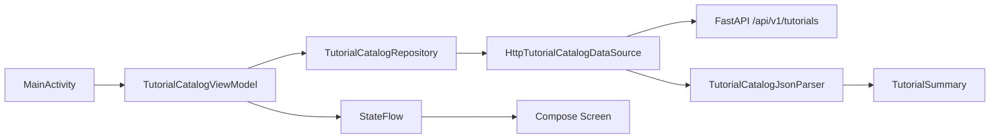

# 模块 07：Android 客户端基础与公开教程目录

## 1. 本模块完成了什么

本模块打通了第一个 Android 纵向切片：应用启动后请求后端公开接口 `GET /api/v1/tutorials`，再把结果显示为适合老年用户阅读的教程目录。

实现范围包括：

- 可复现的 Gradle/AGP/Kotlin/Compose 工程；
- HTTP 请求、JSON 协议校验与 Repository；
- lifecycle-aware ViewModel 和单向数据流；
- 加载、内容、空数据、错误重试四种 UI 状态；
- 大字号、较大触控目标、清晰文案和 TalkBack 标题语义；
- JVM、Lint、APK 构建和真实模拟器 Compose 测试。

暂未实现教程详情、状态图执行、AccessibilityService、悬浮窗或 AI。这是有意的范围控制：先证明“Android 能稳定读取后端发布结果”，再扩展运行时引导能力。

## 2. Android 工具链的分层

Android 开发中常见的几个工具名字很相似，但职责不同：

| 组件 | 本模块版本 | 职责 |
| --- | --- | --- |
| JDK | 17 | 运行 Gradle 和 Java/Kotlin 编译相关工具 |
| Android SDK Platform | 37 | 提供编译期 Android API，决定代码可以引用哪些系统类型 |
| Build Tools | 37.0.0 | 打包资源、DEX 和 APK 的底层工具 |
| Platform Tools | 37.0.0 | 提供 `adb`，连接模拟器或真机 |
| System Image | Android 36 ARM64 | 模拟器实际运行的 Android 操作系统 |
| AVD | Pixel_7 | 系统镜像加屏幕、内存等虚拟硬件配置 |
| Android Emulator | 36.6.11 | 执行 AVD 的宿主机程序 |

`compileSdk = 37` 与 Android 36 模拟器并不冲突。`compileSdk` 是编译能力上限，设备是否能安装主要由 `minSdk` 决定。本模块选择 `minSdk = 26`：它覆盖 Android 8.0 及以上设备，同时避免为非常陈旧系统增加过多兼容分支。以后应根据真实目标用户设备数据重新评估，而不是把该数字视为永久结论。

## 3. 为什么使用 Gradle Wrapper

仓库跟踪以下文件：

```text
android/
├── gradlew
├── gradlew.bat
└── gradle/wrapper/
    ├── gradle-wrapper.jar
    └── gradle-wrapper.properties
```

开发者运行的是 `./gradlew`，Wrapper 会读取 `gradle-wrapper.properties` 并使用项目指定的 Gradle 9.4.1。它解决的问题类似 Maven Wrapper：项目声明构建工具版本，而不是依赖每台机器 PATH 中恰好存在的版本。

发行包还固定了 SHA-256：

```properties
distributionSha256Sum=2ab2958f2a1e51120c326cad6f385153bb11ee93b3c216c5fccebfdfbb7ec6cb
```

这会在首次下载时校验 Gradle ZIP 的完整性。

### 多项目会不会冲突或浪费空间

- 不会因“全局 Gradle 版本”冲突：每个项目的 Wrapper 独立指定版本。
- `~/.gradle/caches` 和 `~/.gradle/wrapper/dists` 是跨项目共享缓存，相同制品通常只保存一份。
- 多个项目固定不同 Gradle/AGP/AndroidX 版本时，缓存中会同时存在多个版本，这是可复现构建所付出的合理空间成本。
- 可以定期由 Gradle 自身清理旧缓存；不要把 `~/.gradle` 复制进项目或提交 Git。

首次冷构建需要下载 Gradle、AGP、AndroidX 和 Compose 制品，本次约耗时 5 分 51 秒；依赖进入缓存后，同一组检查的增量执行约 1 分 19 秒，其中还包含模拟器测试。

## 4. AGP、Kotlin 和 Version Catalog

三者的关系可以类比 Java 后端：

- Gradle 是构建执行器，类似 Maven/Gradle 本身；
- Android Gradle Plugin（AGP）把 Android 编译、资源处理、Manifest 合并和 APK 打包任务接入 Gradle；
- Kotlin 编译器负责 Kotlin 代码；Compose 编译器插件把 `@Composable` 转换为可增量更新的 UI 代码。

AGP 9 已内建 Kotlin 支持，因此本项目没有再应用旧的 `org.jetbrains.kotlin.android` 插件。Compose 编译器插件版本与内建 Kotlin 版本保持一致。

依赖版本集中在 `android/gradle/libs.versions.toml`。Version Catalog 的作用接近 Maven 父 POM 中的 `dependencyManagement`：模块引用稳定别名，版本只在一个位置维护。Compose 组件再通过 BOM 约束同一发布族，减少 `ui`、Material 3 与测试库之间的版本错配。

## 5. 客户端架构与调用链



对应 Java/Python 后端概念：

| Android | Java / Python 中的近似概念 |
| --- | --- |
| `TutorialCatalogDataSource` | HTTP adapter / gateway |
| `TutorialCatalogRepository` | application port / repository protocol |
| `TutorialCatalogViewModel` | 面向界面的 application service |
| `StateFlow<UiState>` | 持续发布的不可变响应模型 |
| Compose 函数 | 根据状态渲染的声明式 view/template |

当前只有一个数据源，仍保留 Repository 边界，是因为下一阶段很可能加入磁盘缓存、离线教程和版本兼容筛选。这里存在明确需求，不是为假设场景提前堆层。

依赖在 `MainActivity` 手工装配，没有引入 Hilt。当前对象图很小，手工依赖注入更容易学习和调试；当 Activity、后台服务和多个作用域共享依赖时，再评估 DI 框架。

## 6. JSON 为什么没有使用注解式序列化

后端响应是数组，每一项包含 `graph_id`、`title`、APP 包名、录制版本、修订号和发布时间。解析器用 `kotlinx.serialization.json` 的 JSON tree API 显式读取必填字段，但没有给模型加 `@Serializable`。

这样做的取舍是：

- 优点：减少一个编译器插件；协议缺字段或字段类型错误时能给出清晰边界错误；JVM 测试简单。
- 缺点：字段映射代码比注解模型多。

当 API DTO 数量明显增长时，可以引入注解式序列化，并把 wire DTO 与 UI model 分离；当前一个小接口不值得增加额外编译配置。

## 7. 单向数据流与生命周期

ViewModel 只向外暴露只读 `StateFlow<TutorialCatalogUiState>`：

```text
用户点击重试
  → ViewModel 发出 Loading
  → Repository 请求数据
  → Content / Empty / Error
  → Compose 根据新状态重新组合
```

UI 不直接修改状态，也不捕获网络异常。`collectAsStateWithLifecycle()` 会在界面处于可见生命周期时收集 Flow，降低 Activity 在后台仍持续更新 UI 的风险。

异常不会直接把服务器错误或堆栈显示给老年用户，而是映射成固定、可行动的错误文案。`CancellationException` 必须重新抛出，否则 ViewModel 刷新或销毁时的协程取消会被误判成普通网络失败。

## 8. 网络与本地开发地址

Android Emulator 是独立虚拟设备，其中的 `127.0.0.1` 指向模拟器自己。Google 模拟器约定 `10.0.2.2` 指向宿主机，因此 Debug 默认地址是：

```text
http://10.0.2.2:8000
```

Android 9 起默认限制明文 HTTP。本项目只在 `src/debug/AndroidManifest.xml` 中设置 `usesCleartextTraffic=true`，用于本地 FastAPI 联调；主 Manifest 和 Release 不开放明文流量。

本机若有其他项目占用 8000，可临时覆盖：

```bash
./gradlew installDebug \
  -PGUOJING_DEBUG_API_BASE_URL=http://10.0.2.2:18000
```

Release 默认值是 `https://api.invalid`，目的是在没有部署配置时明确失败，而不是不小心把生产应用连回开发机。正式构建必须提供 `GUOJING_API_BASE_URL` HTTPS 地址。

## 9. 适老化 UI 的第一层约束

本模块先建立基础视觉与语义规则：

- 正文默认 20sp，标题更大，并尊重用户系统字体缩放；
- 主要按钮至少 56dp 高；
- 不使用只有图标而没有文字的关键操作；
- 使用 `WindowInsets.safeDrawing` 避开状态栏和手势导航区；
- 关键标题标注 heading 语义，方便 TalkBack 用户按标题导航；
- 加载状态同时有进度图形和文字，不只依赖动画；
- 空数据与网络失败分开表达，失败状态给出明确重试动作。

这只是适老化起点。后续仍要在大字体、TalkBack、色觉差异、单手操作、低端设备和真实老年用户可用性测试中持续校验。

## 10. 测试分层

本模块的验证不是一个“大而全”的端到端测试，而是分层定位问题：

1. JSON parser JVM 测试：验证正常响应、根类型错误和必填字段缺失。
2. HTTP data source JVM 测试：用假的 `HttpURLConnection` 验证 URL、方法、错误码和资源释放，不访问网络。
3. ViewModel JVM 测试：替换 Main dispatcher，验证 Content、Empty、Error 与 retry。
4. Android Lint：检查 Android/Compose 静态问题。
5. APK 构建：验证 Manifest、资源合并、Compose 编译和打包。
6. Pixel 7 设备测试：在 Android 16 ARM64 Runtime 中验证内容显示和重试点击。
7. 人工截图检查：确认安全区、字号、层级和空状态布局。

常用命令：

```bash
cd android
./gradlew testDebugUnitTest
./gradlew lintDebug
./gradlew assembleDebug assembleDebugAndroidTest
./gradlew connectedDebugAndroidTest
```

模拟器排查：

```bash
"$ANDROID_HOME/emulator/emulator" -list-avds
"$ANDROID_HOME/platform-tools/adb" devices -l
"$ANDROID_HOME/platform-tools/adb" shell getprop sys.boot_completed
```

`sys.boot_completed` 返回 `1` 才表示 Android 系统真正完成启动；仅在 `adb devices` 中出现不一定已经可以稳定运行测试。

## 11. 本模块之后的边界

目录只证明“发现教程”链路。下一模块需要读取 `GET /api/v1/tutorials/{graph_id}` 的完整状态图，建立教程详情和执行会话，并明确区分：

- 已录制且页面匹配的确定性步骤；
- APP 小幅更新后需要重新验证锚点的步骤；
- 没有已录制教程时只能提供的基础指引；
- 支付、红包、余额等必须暂停自动观察或提升确认等级的高风险步骤。

在这些边界稳定前，不应直接接入 AccessibilityService 自动观察所有页面，也不应让 Agent 自由决定高风险操作。
