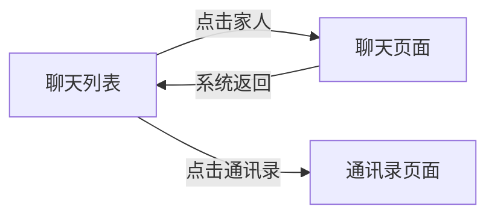
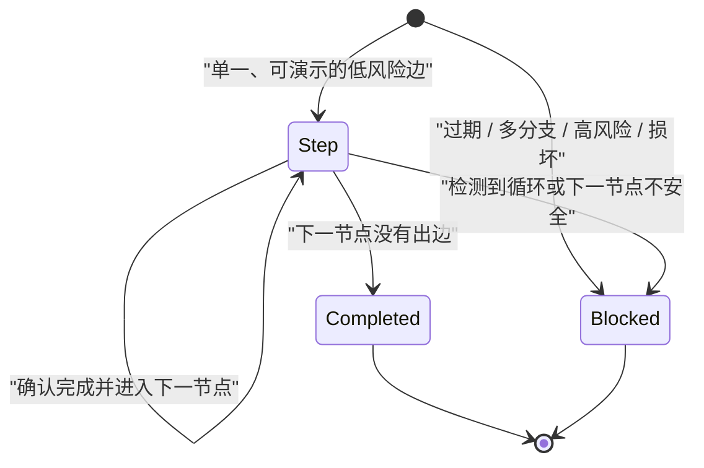

# 模块 08：Android 教程详情与逐步执行

## 1. 本模块解决的问题

模块 07 只能列出“有哪些已发布教程”。模块 08 打通下一段纵向链路：用户点击目录卡片，Android 读取 `GET /api/v1/tutorials/{graph_id}` 的完整状态图，展示教程详情，然后一次显示一个操作步骤。

当前仍是**演示模式**：用户手动点击“我已完成这一步”，客户端尚未观察微信等第三方 APP，也没有证明用户真的进入预期页面。界面明确说明这一限制，避免把按钮确认伪装成自动验证。

完成能力包括：

- 完整教程图协议与防御性 JSON 解析；
- 目录到详情的 Navigation Compose 路由；
- 纯 Kotlin 状态图执行引擎；
- 详情、步骤、完成和安全暂停界面；
- 多分支、循环、过期节点、损坏图和高风险操作拦截；
- JVM、Compose 设备测试与真实 FastAPI 临时数据库联调。

## 2. 为什么教程图不能直接当作步骤数组

线性教程可以写成：

```text
步骤 1 → 步骤 2 → 步骤 3
```

真实 APP 会出现分支、返回、弹窗和重复操作，因此后端模型是图：



节点代表可识别的页面状态，边代表用户操作。如果当前节点有两条边，客户端必须根据目标或当前页面证据选择，不能简单取 `transitions.first()`。当前模块还没有页面观察，所以执行引擎遇到多分支会暂停。

同样，图可能包含循环。例如“向下滚动，直到找到订单”可能重复经过同类页面。没有当前页面证据时，客户端无法判断应该继续循环还是退出，因此重复进入同一 transition 时也会暂停。

这是“领域模型正确性优先于界面演示完整度”的例子。

## 3. 完整 API 契约如何进入 Android

详情响应由两层组成：

```json
{
  "revision_number": 3,
  "published_at": "...",
  "graph": {
    "schema_version": "1.0",
    "graph_id": "wechat_open_family_chat",
    "recorded_app": {},
    "nodes": [],
    "transitions": []
  }
}
```

Android 模型保留：

- 录制 APP 的包名和版本；
- 节点、隐私模式和验证状态；
- required / optional / forbidden 锚点；
- resource id、content description、文本、OCR 文本和归一化坐标；
- transition 的操作类型、说明、风险和目标锚点。

本模块的 UI 尚未使用全部锚点，但仍完整解析它们。这是因为下一模块的本地页面观察必须使用相同协议；如果详情层现在丢弃锚点，下一模块又要重做网络边界。

### 防御性验证

服务端只发布通过领域校验的图，但移动客户端仍然把网络视为不可信边界：

- 只支持 `schema_version = 1.0`；
- 必填字符串拒绝缺失、空白和 `null`；
- wire enum 出现未知值时失败；
- `start_node_id` 必须存在；
- node id 和 transition id 不能重复；
- transition 的源、目标节点必须存在；
- 响应 `graph_id` 必须等于 URL 中请求的 id。

这类似 Java 服务间调用中的防御性 DTO 校验。即使提供方“理论上保证正确”，客户端也不能让错误数据进入业务状态机。

## 4. HTTP 层为什么做了一次重构

模块 07 的目录数据源同时承担了 HTTP 连接和目录解析。详情加入后，如果复制整段 `HttpURLConnection` 代码，会产生两套超时、状态码和资源关闭逻辑。

本模块提取 `HttpJsonClient`：

```text
HttpJsonClient
├── GET、超时、Accept header
├── 非 2xx 错误
├── UTF-8 读取
└── finally disconnect

CatalogDataSource → CatalogJsonParser
DetailDataSource  → DetailJsonParser
```

`HttpJsonClient` 只知道 JSON 文本，不知道教程结构；两个 DataSource 负责 URL 和协议解析。这个边界与 Java 中一个轻量 HTTP client 加多个 typed gateway 类似。

当前仍使用 JDK `HttpURLConnection`。接口只有两个 GET，暂时不需要 OkHttp/Ktor 的拦截器、连接配置或内容协商；需求增长后可以在 DataSource 后替换实现，而 Repository 和 ViewModel 不变。

## 5. Navigation Compose 与返回栈

模块使用稳定版 `androidx.navigation:navigation-compose:2.9.8`。官方版本记录见 [AndroidX Navigation releases](https://developer.android.com/jetpack/androidx/releases/navigation)。

路由结构很小：

```text
catalog
  └── tutorial/{graphId}
```

目录 ViewModel 属于 catalog destination，详情 ViewModel 属于具体 `graphId` 的 back stack entry。进入教程时创建详情 ViewModel；退出 destination 后，Navigation 和 Lifecycle 会负责清理它。

详情页内部的“概览 → 正在执行”不是新的 destination，而是同一个 ViewModel 的 mode。这样系统返回键的行为可以定义为：

1. 正在执行时，先退出执行回到详情；
2. 再次返回，才回到目录。

`BackHandler` 和页面“返回”按钮执行同一规则，避免系统返回与界面按钮产生两个不同状态机。

## 6. 执行引擎是一个纯领域对象

`TutorialExecutionEngine` 不依赖 Activity、Compose、网络或 ViewModel。输入是一张不可变 `TutorialGraph`，输出是不可变 stage：



ViewModel 只能调用：

- `engine.start()`；
- `engine.advance(currentStep)`。

Compose 不能直接传入任意 node id，也不能自己把状态改成 Completed。这与后端中“Controller 不能跳过 domain service 直接改数据库状态”是同一种约束。

## 7. 当前安全策略

| 情况 | 本模块行为 | 原因 |
| --- | --- | --- |
| 单一 low transition | 显示步骤，允许手动确认 | 演示模式可以确定下一边 |
| sensitive transition | 显示额外警告，仍由用户操作 | 敏感但不一定不可逆 |
| financial / irreversible | 硬暂停，没有“完成”按钮 | 不能靠普通确认跨越高风险边界 |
| stale node | 暂停 | 页面已明确失效 |
| 多个 outgoing transition | 暂停 | 没有证据选择分支 |
| 重复 transition / cycle | 暂停 | 没有页面观察判断循环条件 |
| 图数据损坏 | 暂停或加载失败 | fail closed |

高风险判断在执行引擎中，不在文案或 Compose 中。即使未来某个 UI 错误地渲染按钮，ViewModel 也拿不到 `Step`，因此无法调用 `advance`。

支付教程以后并不是永远不能做，而是需要更强的条件：页面确定匹配、APP 版本兼容、风险确认、截图暂停、用户亲自付款，以及必要时家属协助。本模块没有这些能力，所以正确结果是暂停。

## 8. 详情页的单向数据流

```mermaid
flowchart LR
    A["点击目录卡片"] --> B["Navigation graphId"]
    B --> C["DetailViewModel"]
    C --> D["DetailRepository"]
    D --> E["GET tutorial detail"]
    E --> F["Content Overview"]
    F -->|"开始"| G["ExecutionEngine.start"]
    G --> H["Step / Completed / Blocked"]
    H -->|"确认完成"| I["ExecutionEngine.advance"]
    I --> H
```



UI 状态明确区分：

- Loading；
- Error；
- Content + Overview；
- Content + Execution(stage)。

重试会取消旧 load job、清空执行引擎并重新读取详情。协程取消仍重新抛出 `CancellationException`，不会显示成网络错误。

## 9. “用户确认”不等于“页面验证”

“我已完成这一步”只代表用户声明操作完成。当前应用无法知道：

- 微信是否真的位于聊天列表；
- 用户是否点了“家人”；
- 页面是否进入预期 conversation 节点；
- APP 更新后控件是否已经移动或改名。

因此详情页持续显示“当前是演示模式”，学习文档和代码也没有使用 `verified` 之类误导性的命名表示手动点击结果。

下一阶段真正的验证链应当是：

```text
Accessibility 页面证据
  → 本地锚点匹配
  → 当前节点可信度
  → 用户执行操作
  → 下一页面证据
  → expected target node 匹配
  → 才允许推进
```

## 10. 适老化交互细节

- 整张教程卡片可点击，同时保留“查看步骤”文字提示；
- 返回操作使用有文字的大按钮，而不是只有箭头图标；
- 详情先解释工作方式和演示限制，再提供开始按钮；
- 每页只显示一个主要动作；
- 步骤号、指令、当前页面、操作方式和隐私提示分层展示；
- 主按钮 60dp 高，退出按钮 56dp 高；
- 所有长页面可滚动，并继续避开状态栏和手势导航区；
- Blocked 页面给出原因和可行动的退出选项，而不是技术异常。

## 11. 测试策略

本模块完成后 Android 共包含：

- 27 个 JVM 测试；
- 6 个 Pixel 7 / Android 16 Compose 设备测试。

新增 JVM 覆盖：

- 完整 JSON 正常映射；
- schema、enum、`null`、start node 和响应 id 错误；
- URL path segment 编码；
- 线性完成、多分支、循环、stale、sensitive 和 financial 策略；
- Detail ViewModel 的加载、开始、推进、退出和失败重试。

设备测试覆盖：

- 详情页演示模式说明；
- 低风险步骤与手动确认；
- financial 步骤没有确认按钮；
- 目录 → 详情 → 步骤 → 完成的完整 Navigation 流程。

视觉联调使用 `/tmp` 中一次性 SQLite 数据库，通过真实 Alembic、Repository、FastAPI 和模拟器网络完成；没有向仓库的 `data/guojing.db` 写演示教程，也没有提交截图。

## 12. 与 Java/Python 经验的对应

| Android | Java / Python 后端类比 |
| --- | --- |
| Navigation destination | Web route + 页面生命周期作用域 |
| Detail ViewModel | 页面级 application service |
| `StateFlow<UiState>` | 可持续发布的不可变 response model |
| Execution engine | 纯 domain service / aggregate transition policy |
| sealed interface | Java sealed hierarchy / Python tagged union |
| Compose state rendering | 根据 response model 渲染模板 |
| fake Repository JVM test | 用 in-memory port adapter 测 service |

特别值得注意的是，Android 的 ViewModel 不是后端 MVC 中的数据库 Entity；它是跨配置变化保存页面状态和协调异步用例的生命周期组件。

## 13. 当前限制与下一模块

模块 08 尚未：

- 读取当前前台 APP；
- 检查目标 APP 是否安装及其版本；
- 获取 Accessibility 节点树；
- 匹配 required / optional / forbidden anchors；
- 在第三方 APP 上画箭头或框选；
- 截图、OCR、语音或调用 Agent；
- 持久化中途执行进度。

下一模块应先实现用户明确授权的 AccessibilityService 和本地页面观察端口，并把隐私模式放在采集入口执行。只有获得可靠的 `ScreenObservation` 后，才能把手动确认替换为“当前节点和下一节点均已验证”的执行流程。
