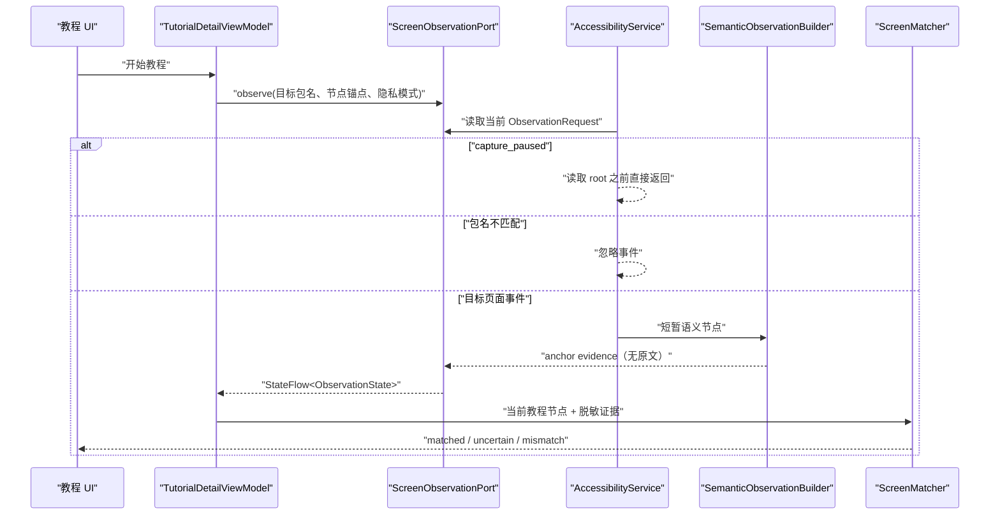

# 模块 09：Android 本地页面观察

## 1. 本模块解决的问题

模块 08 可以把教程状态图逐步展示出来，但“我已完成这一步”只是用户手动确认。APP 不知道用户当前是否真的位于微信聊天列表、地图搜索页或余额页面，也无法判断 APP 更新后界面是否仍与录制教程一致。

本模块建立 Android 页面观察基础：

1. 用户在 APP 内看到独立且清楚的说明，并主动前往系统设置开启页面观察。
2. 教程执行时注册一个有明确目标的观察请求。
3. `AccessibilityService` 只接收少量页面变化事件，只处理目标包名。
4. 原始节点只在一次回调内短暂存在，立即转换为脱敏锚点证据。
5. Kotlin 在本地执行与后端相同的确定性匹配规则。
6. UI 只显示“匹配、不确定、不匹配或隐私暂停”，不显示第三方 APP 的原始文字。

本模块仍不绘制悬浮箭头、不自动点击、不截屏，也不根据一次页面匹配自动推进教程。

## 2. 为什么需要 AccessibilityService

普通 Android APP 只能访问自己的 View/Compose 树。切换到微信、地图或相机后，“老牌子”的 Activity 进入后台，不能直接询问另一个进程当前有哪些按钮。

`AccessibilityService` 是 Android 提供的系统级辅助能力。用户必须在系统设置中明确开启，系统才会把页面变化事件交给 Service。如果配置声明 `canRetrieveWindowContent=true`，Service 可以读取当前活动窗口暴露出来的 `AccessibilityNodeInfo` 树。

节点树是“语义树”，不是屏幕像素：节点可能包含控件 ID、无障碍描述、可见文字、边界和层级关系。它也不保证与真实 View 一一对应；自绘控件、游戏画面或嵌入式 Surface 可能不暴露完整语义。

官方资料：

- [Create your own accessibility service](https://developer.android.com/guide/topics/ui/accessibility/service)
- [AccessibilityService API](https://developer.android.com/reference/android/accessibilityservice/AccessibilityService)
- [AccessibilityNodeInfo API](https://developer.android.com/reference/android/view/accessibility/AccessibilityNodeInfo)

## 3. 系统组件是怎样注册的

Manifest 中的 Service 声明包含三个关键部分：

```xml
<service
    android:name=".observation.GuoJingAccessibilityService"
    android:exported="true"
    android:permission="android.permission.BIND_ACCESSIBILITY_SERVICE">
    <intent-filter>
        <action android:name="android.accessibilityservice.AccessibilityService" />
    </intent-filter>
    <meta-data
        android:name="android.accessibilityservice"
        android:resource="@xml/accessibility_service_config" />
</service>
```

- `BIND_ACCESSIBILITY_SERVICE` 不是普通运行时权限；它限制只有 Android 系统能够绑定这个 Service。
- intent action 让系统把它识别为无障碍服务。
- XML metadata 声明事件范围和读取窗口内容的能力。

本模块只订阅：

- `typeWindowStateChanged`：窗口或页面切换。
- `typeWindowContentChanged`：当前内容变化。
- `typeViewScrolled`：列表滚动后可见节点变化。

没有使用 `typeAllMask`，也没有开启手势执行能力。Service 没有调用 `performAction()` 或 `dispatchGesture()`，因此它只能观察，不能替用户操作。

## 4. 授权不是普通 Permission Dialog

相机权限可以通过 `requestPermissions()` 弹出系统对话框；AccessibilityService 不可以。APP 只能打开：

```kotlin
Intent(Settings.ACTION_ACCESSIBILITY_SETTINGS)
```

然后由用户在系统页面找到“老牌子页面观察”并开启。返回 APP 后，`MainActivity.onResume()` 通过 `AccessibilityManager` 重新检查状态。

本模块在跳转系统设置前显示独立披露，说明：

- 会读取什么：按钮、文字标签、控件位置。
- 为什么读取：判断当前页面是否与教程一致。
- 怎样使用：本地生成页面锚点证据。
- 不会做什么：不自动点击、不保存完整页面、不读取密码文字。
- 用户控制：可以取消，也可以随时在系统设置关闭。

这是产品体验要求，也是 Google Play 对 Accessibility API 的重要政策要求。当前项目没有在 metadata 中草率声明 `isAccessibilityTool=true`；是否符合“主要用于帮助残障人士”的资格，需要在正式发布定位确定后再做合规判断。即使以后符合，清楚告知用户仍然是更好的产品设计。

政策资料：[Use of the AccessibilityService API](https://support.google.com/googleplay/android-developer/answer/10964491)

## 5. 观察调用链



这里的 Port 与 Java 后端常见的接口/适配器模式相同：

- `TutorialDetailViewModel` 依赖 `ScreenObservationPort` 接口。
- Android Service 通过 `AccessibilityObservationCoordinator` 适配系统回调。
- JVM 测试传入 Fake Port，不需要 Android 系统或模拟器。

对应 Python Agent 开发中的做法，是让 workflow 依赖一个 typed tool/protocol，而不是在节点函数里直接操作全局 SDK。

## 6. 为什么 Coordinator 只保存在内存

AccessibilityService 和 Activity 属于同一个应用进程，但生命周期由不同主体控制：Activity 由用户导航驱动，Service 由系统绑定。`AccessibilityObservationCoordinator` 用 `StateFlow` 作为进程内桥梁：

```text
Idle
  → Waiting(request)
  → Available(sanitized observation)
  → Waiting(next request) / Idle

CapturePaused(request) 不进入 Available
```

它没有数据库、文件或网络写入。进程被系统杀死后状态自然消失，这正符合页面观察的最小保存原则。教程可以重新开始，但第三方页面内容不应被恢复。

## 7. 隐私闸门为什么必须位于采集入口

错误方案是：先读取完整页面，再判断它是不是密码页并删除数据。这意味着敏感内容已经进入内存中的通用处理链，后续日志、异常上报或调试工具都有可能意外接触它。

本模块按三种模式处理：

| 模式 | 是否调用 `rootInActiveWindow` | 输出 |
|---|---:|---|
| `network_allowed` | 是 | 脱敏锚点证据，标记为可按后续策略联网 |
| `local_only` | 是 | 脱敏锚点证据，强制仅本地 |
| `capture_paused` | 否 | 只有“已暂停”状态 |

此外，即使节点处于允许观察的页面，只要 Android 把某个节点标记为 `isPassword`，适配器就不会读取该节点的 `text` 或 `contentDescription`。

注意：本模块根本没有上传实现。`SanitizedNetworkAllowed` 只是证据能力标签，不等于自动授权网络传输。未来如果增加网络诊断，还需要独立用例和用户可见策略。

## 8. 为什么运行时还要检查目标包名

教程请求已经知道目标包名，例如微信是 `com.tencent.mm`。Service 收到事件后先比较：

```kotlin
if (event.packageName != request.targetPackageName) return
```

这样用户切换到短信、相册或银行 APP 时，事件虽然可能由 Android 分发给 Service，但老牌子不会读取其节点树。由于事件可能在快速切换 APP 后延迟到达，代码还会独立检查 `rootInActiveWindow.packageName`；事件包名和实时根节点包名必须同时等于教程目标包。

配置 XML 没有写死 `packageNames`，因为不同教程可能指导微信、地图、系统相机等不同 APP。固定配置无法随当前教程切换；运行时白名单则把范围限制在“正在执行的一个教程目标包”。

## 9. 从原始节点到 ScreenObservation

`AccessibilityNodeInfo` 不会离开 Service 回调。适配器最多遍历 500 个节点、30 层深度，并把单个语义字符串限制为 200 字符，防止异常页面造成无界内存或耗时。

`SemanticObservationBuilder` 立即把节点转换为：

```text
ObservedApp(packageName, versionName, versionCode)
AnchorEvidence(anchorId, confidence)
structureScore
sharingPolicy
```

对外结果不包含：

- 页面完整文本。
- 联系人或聊天内容。
- 余额、红包金额。
- Accessibility 节点树。
- 截图或 OCR 图片。

当前置信度优先级是：

| 证据 | confidence | 说明 |
|---|---:|---|
| resource ID 精确匹配 | 1.00 | 通常最稳定 |
| content description 精确匹配 | 0.95 | 适合图标按钮 |
| text 规范化后精确匹配 | 0.90 | 文案变化时容易失效 |
| bounds fallback 接近 | 0.65 | 只能辅助，不能单独证明锚点存在 |

当前 `structureScore` 是保守基线：计算必需锚点的出现比例；节点没有必需锚点时才使用可选锚点。禁止锚点的正确缺席和可选锚点的缺失不会反向惩罚结构分。相对位置约束会在后续锚点边界模块中加入，届时结构分才能真正描述控件布局。

OCR 字段在这里被明确忽略，因为 AccessibilityService 不是 OCR 来源。后续 OCR 模块可以生成独立来源的候选证据，不能伪装成 Accessibility 结果。

## 10. Kotlin 与 Python 匹配规则保持一致

后端模块 01 已经定义确定性匹配参考：

```text
required_weight = 0.75
optional_weight = 0.10
structure_weight = 0.15
anchor_presence_threshold = 0.80
matched_score_threshold = 0.90
```

Kotlin `ScreenMatcher` 使用相同权重和阈值，并保留相同语义：

- 包名不一致：`mismatch`。
- forbidden 锚点出现：`mismatch`。
- required 锚点缺失：`uncertain`。
- 必需锚点齐全但总分不足：`uncertain`。
- 强证据：`matched`。

为什么不直接请求后端匹配？因为 `local_only` 页面不能发送证据；而且老人操作教程时需要低延迟、弱网可用。后端 Python 实现是协议参考和管理端诊断规则，Android Kotlin 实现是真正的本地执行者。

长期应把同一组 JSON 测试向量同时喂给 Python 和 Kotlin，防止两端修改阈值后悄悄漂移。本模块先用对应行为测试建立基线。

## 11. 为什么还没有自动推进

“当前页面 matched”只能证明操作前页面大概率正确，不能证明用户完成了 transition。

可靠推进需要：

```text
当前 source node 匹配
  → 用户看到目标框选并亲自操作
  → 观察到新的稳定页面
  → target node 匹配
  → 低风险 transition 才完成
```

如果现在看到 source node 匹配就自动推进，会把“尚未点击”误认为“点击成功”。因此本模块仍显示手动确认按钮，并明确它不是目标页面验证。

金融和不可逆步骤继续由 `TutorialExecutionEngine` 硬拦截。页面匹配提高了环境置信度，但不扩大安全授权。

## 12. 测试策略

本模块完成后 Android 包含 40 个 JVM 测试，覆盖：

- 三种隐私模式。
- 非目标包忽略。
- resource ID、文字和边界置信度。
- required / optional / forbidden 锚点匹配。
- 旧请求不能覆盖当前会话。
- ViewModel 注册当前节点并消费脱敏证据。
- 原有解析器、Repository 和执行安全策略回归。

Pixel 7（API 36）运行 8 个 Compose / Navigation 测试，新增覆盖：

- 未授权状态可理解。
- 必须主动点击同意才能打开系统设置。
- 本地匹配只展示状态，不展示观察原文。
- 原有目录到教程完成流程继续可用。

验证命令：

```bash
cd android
./gradlew testDebugUnitTest lintDebug assembleDebug assembleDebugAndroidTest
./gradlew connectedDebugAndroidTest
```

## 13. 当前限制与下一模块

当前实现还没有：

- 在目标 APP 上方显示步骤卡、箭头或框选。
- 把匹配锚点的边界传给绘制层。
- 等待页面稳定并验证 transition 的 target node。
- 在 verified / provisional 兼容性状态间形成完整闭环。
- OCR、自绘页面识别或截图提问。
- Agent 决策。

下一模块将优先实现 Accessibility Overlay：只使用已匹配目标锚点的脱敏边界绘制框选、箭头和大字指令。用户操作后，执行器等待并匹配 target node；只有低风险且目标状态可靠时才推进。这样“看哪里、做什么、是否成功”才形成一个真正的跨 APP 教程循环。
