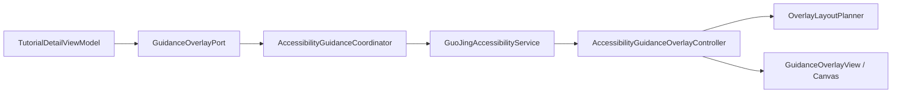
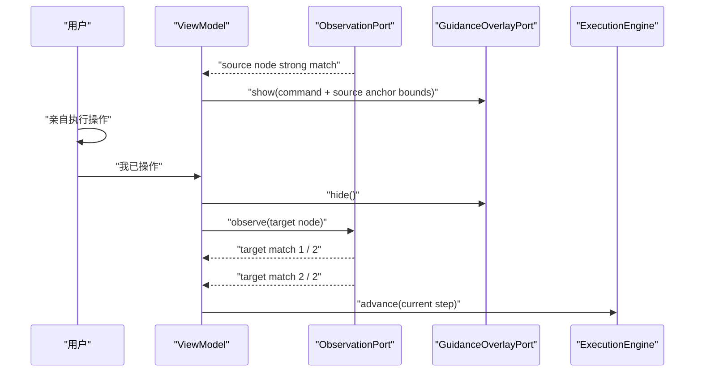

# 模块 10：Android 跨 APP 可见引导与结果验证

## 1. 本模块解决的问题

模块 09 已经能在本地判断“用户当前页面是否像教程的 source node”，但用户切到微信、设置或地图后，老牌子的 Activity 已经在后台。只在老牌子界面写“点击某按钮”，老人仍要记住文字、切换 APP、再自己寻找目标。

本模块闭合一条低风险教程循环：

```text
source node 强匹配
  → 在目标 APP 上绘制框选、箭头和大字步骤卡
  → 用户亲自点击
  → 用户回到老牌子声明“我已操作”
  → 观察 target node
  → 连续两次强匹配
  → TutorialExecutionEngine 推进
```

这里特意保留了“用户亲自操作”和“执行引擎推进”两个边界。浮层只解释，不点击；ViewModel 只提交经过页面证据验证的 transition，不能直接篡改图状态。

## 2. 为什么使用 Accessibility Overlay

普通 Compose `Dialog` 或 `Popup` 只能出现在老牌子自己的 Activity 窗口中。用户切到目标 APP 后，需要由已经获得用户授权的 `AccessibilityService` 创建 `TYPE_ACCESSIBILITY_OVERLAY` 窗口。

Android 将这种窗口定义为由已连接无障碍服务显示的覆盖层。它与普通 `SYSTEM_ALERT_WINDOW` 悬浮窗不是同一授权模型；本项目没有申请“显示在其他应用上层”的普通悬浮窗权限。官方 API：

- [AccessibilityService](https://developer.android.com/reference/android/accessibilityservice/AccessibilityService)
- [WindowManager.LayoutParams.TYPE_ACCESSIBILITY_OVERLAY](https://developer.android.com/reference/android/view/WindowManager.LayoutParams)
- [Create your own accessibility service](https://developer.android.com/guide/topics/ui/accessibility/service)

窗口参数的核心是：

```kotlin
TYPE_ACCESSIBILITY_OVERLAY
FLAG_NOT_FOCUSABLE
FLAG_NOT_TOUCHABLE
FLAG_LAYOUT_IN_SCREEN
FLAG_LAYOUT_NO_LIMITS
```

- `NOT_FOCUSABLE`：浮层不抢走输入焦点。
- `NOT_TOUCHABLE`：浮层自身不接收触摸；点击继续交给目标 APP。
- `LAYOUT_IN_SCREEN` / `LAYOUT_NO_LIMITS`：允许引导跨越完整可用窗口区域。

设备验证中，红框覆盖 `Network & internet` 后，点击同一位置仍进入系统设置的目标页面，证明浮层没有变成替用户操作的交互层。

## 3. 组件边界

本模块把“业务命令”和“Android 窗口”分开：



`GuidanceOverlayCommand` 只包含：

```text
targetPackageName
stepNumber
instruction
targetBounds（可空的归一化边界）
```

没有包含节点树、聊天内容、联系人、余额或页面截图。这里与 Java 后端常见的 Hexagonal Architecture 相同：ViewModel 依赖 Port，Android `WindowManager` 是 Adapter；JVM 单元测试换成 Fake Port 就能检查“何时显示、何时隐藏”。

对应 Python Agent 开发，可以把 `GuidanceOverlayPort` 理解为 typed tool protocol。Agent 或 workflow 可以提出“显示这个解释”的意图，但系统适配器和确定性策略决定它是否真的可以显示。

## 4. 从语义锚点到屏幕坐标

模块 09 的 `AnchorEvidence` 只有 `anchorId + confidence`。本模块增加：

```kotlin
normalizedBounds: NormalizedScreenBounds?
```

边界只有在锚点置信度至少为 `0.80` 时才保留；弱位置回退不能制造一个看似确定的红框。边界使用 0 到 1 的显示坐标，避免把 Pixel 7 的绝对像素写进教程协议。

一个容易忽略的 Android 细节是：

- `AccessibilityNodeInfo.getBoundsInScreen()` 返回显示屏坐标；
- Overlay `View` 的 Canvas 使用窗口本地坐标；
- 状态栏可能让 Overlay View 的原点不等于屏幕 `(0, 0)`。

所以不能简单计算 `normalizedTop * view.height`。实现会读取 Overlay View 的 `getLocationOnScreen()`，先恢复显示屏像素，再减去窗口原点：

```text
localX = normalizedX × displayWidth  - viewportLeft
localY = normalizedY × displayHeight - viewportTop
```

第一次真实截图检查就发现了系统栏造成的纵向偏移；加入视口转换和纯 Kotlin 回归测试后，框选才与 `Network & internet` 文字对齐。这也是为什么重要 UI 改动不能只依赖单元测试。

## 5. 为什么精确文字匹配是 1.0

真实联调还暴露了一个评分组合问题。匹配公式是：

```text
score = required × 0.75 + optional × 0.10 + structure × 0.15
matched threshold = 0.90
```

如果只有一个必需文字锚点，文字“完全相等”却只给 `0.90` confidence，那么最高分是：

```text
0.90 × 0.75 + 1.00 × 0.15 = 0.825
```

它永远无法达到 `0.90`，意味着没有稳定 resource ID 的教程永远不能显示引导。现在把规范化后的 resource ID、content description 和 text **精确相等**都记为本次观测的 `1.0`；这不代表 APP 未来不会改版，只表示当前两段确定性字符串确实相等。

版本漂移仍由 recorded app compatibility、forbidden anchors、结构分和 target node 验证处理。模糊文本、OCR 相似度或模型判断以后必须使用独立证据类型，不能借用这个 `1.0`。

## 6. 为什么相同观察也必须发出序列

Kotlin `StateFlow` 会合并 `equals()` 相等的值。连续两个相同页面事件如果产生完全相同的 `ScreenObservation`，第二个值原本不会通知 ViewModel。

本模块给 `ObservationState.Available` 增加单调递增的 `sequence`：

```text
Available(sequence=41, observation=X)
Available(sequence=42, observation=X)
```

证据内容可以相同，但它们来自两个独立系统事件，因此状态值不再相等。`stop()` 会清空会话并重置序列；序列不落库，也不是审计 ID。

这与消息系统中的“payload 相同不等于同一条消息”相似。Java 后端若用 Kafka，通常依赖 offset；这里用进程内 sequence 表达同一概念。

## 7. source 与 target 是两次不同验证

页面状态图的一条 transition 有 source node 和 target node：



source 匹配只回答“起点对不对”，不能证明动作发生。target 匹配才回答“结果页面是否出现”。为了避免动画中间态或一次偶发事件，当前 MVP 要求连续两次强匹配。

`TransitionVerificationStatus` 明确建模：

- `Ready`：尚未开始结果确认。
- `CheckingTarget(matched, required)`：正在累计稳定证据。
- `TargetUncertain`：证据不足，停在当前步骤。
- `TargetMismatch`：进入了错误页面，停在当前步骤。
- `CapturePaused`：隐私策略禁止观察。

不确定或不匹配时，UI 明确提示“不要重复操作”。对红包、支付、拉群等动作，这比诱导老人再点一次更重要。

## 8. 为什么现在仍需要返回老牌子确认

MVP 流程要求用户操作后回到老牌子点击“我已操作，切回目标 APP 确认”，再回到目标 APP。它多一次切换，但有三个好处：

1. 不把任意 `TYPE_WINDOW_CONTENT_CHANGED` 猜成用户已经点击。
2. 不要求 Service 监听更广泛的点击内容或保存操作历史。
3. 在未来引入语音确认、悬浮球确认或可靠 action event 前，保持状态转换可解释。

这是当前明确限制，不是最终交互目标。后续可以在保持同一 target 验证门槛的前提下，把“我已操作”改为语音或更简单的可见确认，但不能因为减少一次切换就自动调用节点动作。

## 9. Service 生命周期所有权

Android 可以销毁并重新绑定 `AccessibilityService`，而 Activity/ViewModel 中的教程会话仍存在。如果 Service 的 `onDestroy()` 调用全局 `observation.stop()`，会把 ViewModel 正在等待的请求清空，界面永久停在“正在准备”。

本模块修正了所有权：

- ViewModel 启动、切换和停止逻辑观察会话。
- Service 只消费当前请求并管理自己持有的 Window。
- Service 销毁时释放 Overlay View 和协程，不销毁 ViewModel 的业务会话。
- 新 Service 连接后重新发布当前请求，并从 `StateFlow` 恢复当前浮层命令。

这和 Spring 中“Servlet 容器回收连接对象，不应顺手删除 application session”是同一类生命周期边界问题。

## 10. 隐私与安全不变量

浮层加入后，模块 09 的采集闸门仍然优先：

- `capture_paused` 在读取 `rootInActiveWindow` 前返回。
- 事件包名和实时根节点包名都必须等于教程目标包。
- 原始节点文字只在一次回调内存在，不进入 ViewModel 或 Overlay 命令。
- `local_only` 证据不上传。
- 切换到非目标 APP 时临时隐藏浮层。
- source 页面不再强匹配时隐藏浮层。
- Service 不调用 `AccessibilityNodeInfo.performAction()`，也不调用 `dispatchGesture()`。
- 金融和不可逆 transition 仍由 `TutorialExecutionEngine` 阻断。

Google Play 对 Accessibility API 有单独披露、同意和行为限制，正式发布前仍需以实际商店定位复核：[Use of the AccessibilityService API](https://support.google.com/googleplay/android-developer/answer/10964491)。

Debug 日志只记录包名、教程节点 ID、锚点 ID 和置信度，不记录屏幕原文或边界对应的真实内容；Release 构建不输出这些诊断日志。

## 11. 测试策略

本模块的自动化验证分三层：

1. 纯 Kotlin：布局上下放置、边界裁剪、系统栏视口偏移、重复观察序列、浮层 coordinator。
2. ViewModel：source 匹配显示正确目标边界；target 第一次匹配不推进；第二次才完成；不确定证据不推进。
3. Compose 设备测试：观察模式按钮、目标验证中提示、原有导航和手动模式回归。

真实 Pixel 7（API 36）还执行了一条临时系统设置教程：

```text
Settings 首页
  → 识别 Network & internet（confidence 1.0）
  → 红框、箭头和大字卡对齐
  → 点击穿透浮层
  → 进入包含 Internet 锚点的目标页
  → 连续两次 target match
  → 老牌子显示“教程已完成”
```

临时数据库、模拟器截图和系统状态不会提交到仓库。

验证命令：

```bash
cd android
./gradlew testDebugUnitTest lintDebug assembleDebug assembleDebugAndroidTest
./gradlew connectedDebugAndroidTest
```

还要运行后端、网页和仓库级回归，因为 README、协议说明和共享开发规则同时发生了变化。

## 12. 当前限制与下一模块

当前实现仍有明确边界：

- 只有 Accessibility 暴露语义节点的页面才能精确框选；自绘、Canvas、游戏或视频画面可能没有节点。
- 没有 OCR、视觉模型或截图问答。
- 没有语音播报和浮悬球确认，用户操作后仍需返回老牌子一次。
- 连续两次事件是稳定性的最小近似，还没有时间窗口、页面动画去抖和跨设备采样。
- 没有对多窗口、横屏、折叠屏做产品级视觉验收。
- “无已录制教程”的基础指引尚未接入 Agent。

下一模块将先建立用户主动截图求助入口和本地隐私预处理端口。目标不是立刻让模型看见一切，而是先把图片来源、敏感区域、脱敏结果、是否允许联网和审计边界建模清楚，再接 OCR/视觉模型与 Deep Agents。这样未录制 APP 的基础指引也能沿用现有的“只解释、用户亲自操作、结果可验证”安全框架。
