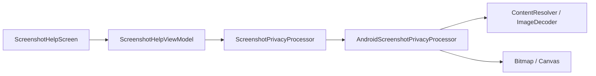

# 模块 11：Android 截图求助与本地脱敏

## 1. 本模块解决的问题

前十个模块的教程执行依赖已经录制并发布的状态图。但用户遇到的真实问题经常不在教程库里，例如某个地方银行 APP 改版后找不到按钮，或第一次打开一个尚未录制的 APP。

本模块建立截图求助的第一段可信链路：

```text
用户主动选择一张截图
  → Android 在本机读取并限制尺寸
  → 用户框选敏感区域并填写问题
  → Canvas 生成永久遮挡的全新像素副本
  → 清理原始内存副本
  → 显示本地处理记录
```

终点故意停在“脱敏副本已准备好”。本模块没有 OCR、视觉模型、网络上传或 Agent，因此界面明确显示“尚未发送给 AI”。先证明隐私边界，再连接智能能力，后续问题会更容易定位和审计。

## 2. 为什么选择系统 Photo Picker

如果应用只需要用户主动选中的一张截图，就不应申请读取整个图库。Android Photo Picker 由系统提供选择界面，用户只把选中的媒体项临时授权给应用。官方文档也将它定义为无需授予整个媒体库访问权的安全方式：

- [Photo picker](https://developer.android.com/training/data-storage/shared/photo-picker)
- [Access media files from shared storage](https://developer.android.com/training/data-storage/shared/media)

Compose 页面通过 Activity Result API 发起选择：

```kotlin
val picker = rememberLauncherForActivityResult(PickVisualMedia()) { uri ->
    uri?.let { viewModel.importScreenshot(it.toString()) }
}

picker.launch(PickVisualMediaRequest(PickVisualMedia.ImageOnly))
```

这里没有 `READ_MEDIA_IMAGES`，也没有自制图库页面。系统 Picker 负责展示媒体和返回选择结果，老牌子只获得完成本次处理所需的最小能力。

我们也没有调用 `takePersistableUriPermission()`。官方说明默认授权只在设备重启或应用停止前有效；长时间后台工作才可能需要持久化。老牌子的原图只服务于当前可见会话，因此不应把临时选择扩大为长期能力。

## 3. `content://` URI 不是文件路径

Picker 返回的是类似下面的 URI：

```text
content://media/picker/...
```

它可以理解为“由某个 ContentProvider 管理的一次访问能力”，不能当成 `/sdcard/Pictures/a.png`，也不能依赖 `File(uri.path)`。正确入口是 `ContentResolver`。官方 API 说明 `openInputStream()` 和 `openFileDescriptor()` 都可用于读取 `content` URI；`ImageDecoder` 还可以直接用 `ContentResolver + Uri` 创建数据源：

- [ContentResolver](https://developer.android.com/reference/android/content/ContentResolver)
- [ImageDecoder](https://developer.android.com/reference/android/graphics/ImageDecoder)

本模块甚至不把 URI 放进 `UiState`。ViewModel 把字符串立即交给处理端口，处理完只保留重新编码后的内存副本。对应 Java 后端，可以把 URI 看成一个短期 signed URL 或 capability token，而不是领域实体的永久 ID。

## 4. Port 与 Android Adapter

截图处理边界被定义为：

```kotlin
interface ScreenshotPrivacyProcessor {
    suspend fun importFromPicker(uriString: String): InMemoryScreenshot
    suspend fun sanitize(
        source: InMemoryScreenshot,
        redactions: List<NormalizedRedaction>,
    ): InMemoryScreenshot
}
```

组件关系是：



ViewModel 不依赖 `ContentResolver`、`Bitmap` 或文件系统，所以问题门槛、状态转换和清理行为可以在普通 JVM 上测试。Android Adapter 才负责 URI、图片编解码和像素绘制。

这与熟悉的 Spring 结构完全对应：application service 依赖 interface，Android framework 相当于 infrastructure adapter。对 Python Agent 来说，Port 类似一个 typed tool protocol；上层流程知道输入输出，但不把平台实现写进 workflow。

## 5. 为什么导入后立即缩放并重新编码

原始截图可能来自高分辨率长截图，也可能是 HEIF、PNG 或 JPEG。直接长期持有原始数据会带来三个问题：

1. 解码内存不可控，例如一张 `6000 × 12000 × 4` 的 ARGB 图片理论像素内存约 275 MiB。
2. 后续 UI、OCR 和网络请求面对不同格式与 EXIF 方向，边界复杂。
3. 原始容器可能携带本模块不需要的元数据。

当前策略是最长边限制为 1440 像素，使用软件 Bitmap，并重新编码为质量 92 的 JPEG；编码结果还必须不超过 8 MiB。`ImageDecoder.OnHeaderDecodedListener` 会在真正产生目标 Bitmap 前得到原尺寸，因此可通过 `setTargetSize()` 限制输出。软件 allocator 是因为后面需要把像素绘制到 Canvas，而不是只交给 GPU 显示。

Android 8.x 的兼容分支使用 `BitmapFactory + inSampleSize`。它只能按 2 的幂采样，输出可能比 1440 更小，但仍保持安全上界。

### 真实设备发现的解码问题

最初实现用两次 `openInputStream()`：第一次只读尺寸，第二次解码像素。内存测试和自建 `content://` 数据都能通过，但 Pixel 7 的真实 Photo Picker Provider 在第一次 `decodeBounds` 就返回失败。

这说明 ContentProvider 不是普通文件系统：不同 Provider 可以使用管道、代理或不同的打开语义，不能根据本地文件经验推断它一定支持某种重复读取方式。API 28+ 改用官方提供的 `ImageDecoder.createSource(ContentResolver, uri)` 后，真实 Picker 导入成功。这个回归被进一步固化成 MediaStore URI 设备测试。

## 6. 归一化框选坐标

用户拖出的矩形保存为 0 到 1 的相对坐标：

```text
left   = x1 / previewWidth
top    = y1 / previewHeight
right  = x2 / previewWidth
bottom = y2 / previewHeight
```

这样同一个矩形既能画在 Compose 预览上，也能乘以 Bitmap 的真实宽高生成像素遮挡，不会绑定 Pixel 7 的 dp 或某次缩放后的预览尺寸。

`NormalizedRedaction.fromDrag()` 还会：

- 允许从右下向左上拖动，并自动重排边界；
- 将越界坐标裁剪到 `[0, 1]`；
- 拒绝宽或高小于 2% 的误触；
- 每次会话最多接受 20 个矩形。

本模块的预览严格按图片宽高比铺满容器，因此没有 `ContentScale.Fit` 留白导致的坐标偏移。未来如果在固定高度容器中显示图片，就必须把 letterbox 留白从触摸坐标中扣除。

## 7. 为什么框选模式一次只画一处

截图页面本身可以上下滚动，图片又需要识别拖动手势。如果图片区域始终拦截 drag，用户从长截图上向上滑时，会意外新增一个遮挡矩形，而页面没有滚动。对不熟悉手势的用户，这种“同一个动作有两个含义”尤其危险。

真实 Pixel 7 验收发现这个冲突后，交互改成：

```text
点击“添加遮挡区域”
  → 明确进入框选模式
  → 拖动完成一处
  → 自动退出框选模式
```

退出后在图片上滑动只负责滚动页面。如果想再遮一处，需要再次点击按钮。这多一次点击，却让状态可见、行为可预测，也避免把无意滑动永久写入脱敏结果。

## 8. 预览遮罩不等于真正脱敏

编辑阶段用 Compose Canvas 画半透明黑块和边框，只是告诉用户“选中了哪里”。如果直接上传原始 ByteArray，再把 UI 覆盖层当成脱敏，接收方仍能得到完整原图。

真正脱敏发生在 `AndroidScreenshotPrivacyProcessor.sanitize()`：

1. 从会话 ByteArray 解码原图。
2. 创建新的 ARGB Bitmap。
3. 先画入原图。
4. 将每个归一化矩形换算成像素矩形。
5. 用不透明纯黑 Paint 覆盖真实像素。
6. 把新 Bitmap 重新编码成新的 ByteArray。

设备测试会解码最终副本，断言遮挡中心像素接近黑色、未遮挡角落仍接近白色。真实模拟器验收也在最终副本中确认了黑块。这是“视觉看起来遮住”和“数据已经不可恢复”之间的关键区别。

## 9. 状态机与确定性门槛

UI 没有散落多个互相矛盾的 Boolean，而是明确建模：

```text
AwaitingSelection
  → Importing
  → Editing
  → Sanitizing
  → Ready
```

失败时：

- 导入失败回到 `AwaitingSelection(error)`，不保留 URI。
- 脱敏失败回到 `Editing(error)`，保留当前内存原图以允许用户重试。
- 返回、换图或 ViewModel 销毁都会取消任务并清理当前会话图片。

“生成脱敏副本”只有同时满足以下条件才启用：

```text
问题非空
AND
(至少一个遮挡区域 OR 用户明确确认没有敏感内容)
```

这是确定性 safety gate，不交给模型判断。新增第一个遮挡区域时，“没有敏感内容”确认会自动清除，避免两种互斥事实同时成立。

## 10. 内存清理能保证什么

`InMemoryScreenshot.erase()` 会用零覆盖持有的 ByteArray。成功生成脱敏副本后清零原始编码数据；返回、换图和 `onCleared()` 也会尽力清零当前副本。

这是一种 best-effort 缩短敏感数据生命周期的措施，不是密码学意义上的内存擦除保证：

- JVM/ART 和 native 图片解码器可能产生临时副本；
- GC、系统截图、交换或崩溃转储不受这一个 ByteArray 控制；
- Compose 预览期间还存在解码后的 Bitmap，状态退出时才调用 `recycle()`；
- Kotlin/Java 没有通用 API 保证编译器和运行时不会复制内存。

因此正确表述是“本模块不落盘、不持久化 URI，并尽量及时清理会话缓冲区”，不能宣传为“原图从未在内存出现”或“绝对无法恢复”。这和 Java 服务中清零 `char[]` 密码优于长期保留 String、但仍不能保证整个进程无副本是同一类边界。

## 11. SHA-256 处理记录的作用

脱敏副本生成后计算 SHA-256，UI 只显示前 12 位作为本次处理记录。它可以帮助后续请求确认“发送的是刚才这份副本”，而不需要把原图内容写入日志。

它不能证明：

- 图片一定没有遗漏隐私；
- 遮挡逻辑一定正确；
- 某个第三方一定收到或删除了图片；
- 用户是谁。

所以这里称为 receipt/checksum，而不是安全证明或合规审计结论。完整摘要保留在内存状态中，后续如果加入上传，可作为请求完整性字段。

## 12. 测试与真实验收

本模块验证分为三层：

1. JVM：框选坐标裁剪与误触过滤；ViewModel 的 URI 不泄漏、门槛、成功清理、失败重试和退出清理。
2. Compose 设备测试：入口导航、隐私说明、框选模式、生成按钮状态和“尚未发送”文案。
3. Android Adapter 设备测试：真实 MediaStore `content://` 导入、1600×800 缩放到 1440×720，以及最终黑色像素覆盖。

Pixel 7（API 36）的人工闭环还验证了：系统 Picker 的单张授权提示、真实截图导入、一次一处框选、页面滚动、问题输入、生成副本、摘要显示和最终像素黑块。临时测试图片与验收截图不会提交仓库。

验证命令：

```bash
cd android
./gradlew testDebugUnitTest lintDebug assembleDebug assembleDebugAndroidTest
./gradlew connectedDebugAndroidTest
```

## 13. 当前限制与下一模块

当前边界是：

- 隐私区域由用户手动框选，还没有本地 OCR 或敏感实体建议。
- JPEG 会移除透明通道并使用白色背景，不适合需要透明像素的通用图片编辑，但适合手机截图求助。
- 只处理当前会话的一张图片；没有草稿恢复、历史记录或后台任务。
- 没有把脱敏副本发送给后端，也没有调用任何模型。
- 没有自动判断 APP、当前页面或已录制教程是否匹配。

下一模块将先定义“截图求助请求”与显式发送确认，再连接后端的受控接收边界。后端需要区分教程匹配与基础解释、限制临时对象保留时间，并只让后续 OCR/视觉/Agent 看见经过确认的脱敏副本。在选择 OCR/视觉服务及新增依赖前，会先说明可选技术栈、环境影响和隐私取舍。
